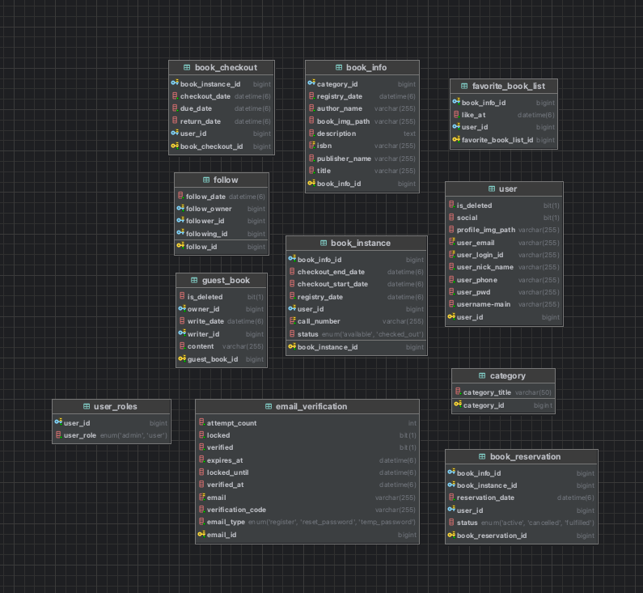

## 개발환경 및 개발도구

### Frontend<br/>


### Backend<br/>


### DataBase<br/>


### Build


### 협업


<br>

### ERD


| 테이블명               | 설명              |
|--------------------|-----------------|
| user               | 회원 정보           |
| user_roles         | 회원 권한           |
| book_info          | 도서 정보           |
| book_checkout      | 도서 대출 정보        |
| book_instance      | 물리적 책에대한 현황, 정보 |
| book_reservation   | 도서 예약 정보        |
| favorite_book_list | 좋아요한 도서 리스트     |
| follow             | 팔로워, 팔로우        |
| guest_book         | 방명록             |
| email_verification | 이메일 인증 정보       |
| category           | 카테고리            |

## API 명세서
### AuthUserController
| HTTP Method | API                                       | Description                   | Request Body/Params                                                                                                                                                                                                                    | Response Body                                         |  Bearer &lt;accessToken&gt; |
|-------------|-------------------------------------------|-------------------------------|----------------------------------------------------------------------------------------------------------------------------------------------------------------------------------------------------------------------------------------|-------------------------------------------------------|---------------|
| PUT         | /api/auth/user/password-reset             | 회원 비밀번호 초기화                   | Request Body : <br/>{<br>&nbsp;&nbsp;"userLoginId": "hamster123",<br>&nbsp;&nbsp;"resetPwd": "p@ssw0rd"<br>}                                                                                                                           | 성공 : "재설정 성공."<br/> 실패 : "재설정 실패."                    | O |
| PUT         | /api/auth/user/update                     | 회원 정보 수정                      | Request Body(Form-Data) : <br/>{<br>&nbsp;&nbsp;"profileImg" : File,<br>&nbsp;&nbsp;"usernameMain": "김**"<br>&nbsp;&nbsp;"userNickname": "김*하이"<br/>&nbsp;&nbsp;"userPhone": "01012341234"<br/>&nbsp;&nbsp;"userPwd": "pass1234"<br/>} | 성공 : "정보 수정 성공."<br/> 실패 : "정보 수정 실패."                | O  |
| POST        | /api/auth/user/follow/{targetUserId}      | 팔로우, 언팔로우                     | Path Variable: userId                                                                                                                                                                                                                  | 성공 : "팔로우, 언팔로우 성공."<br/> 실패 : "팔로우, 언팔로우 실패."        | O  |
| POST        | /api/auth/user/follow-list/{targetUserId} | targetUserId의 팔로우, 팔로워 리스트 조회 | Path Variable : userId,<br/>Request Param : type, page, size                                                                                                                                                                           | 성공 : [아래 참조](#follow-list)<br/> 실패 : "조회 실패."         | O  |
| POST        | /api/auth/user/check-pw                   | 비밀번호 확인                       | Request Body : <br/>{<br>&nbsp;&nbsp;"userPw": "!eeee1234"<br/>}                                                                                                                                                                             | 성공 : "비밀번호 확인 성공."<br/> 실패 : "비밀번호 확인 실패."            | O  |
| DELETE      | /api/auth/user/delete                     | 회원 탈퇴                         |                                                                                                                                                      | 성공 : "회원탈퇴 성공."<br/> 실패 : "회원탈퇴 실패."                  | O  |
| GET         | /api/auth/user/recommend/similar-user     | 비슷한 취향의 유저 추천                 |                                                                                                                                                      | 성공 : [아래 참조](#recommend-user-list)<br/> 실패 : "조회 실패." | O  |

### PublicUserController

| HTTP Method | API                             | Description     | Request Body/Params                                                                                                                                                                                                                                                                                                                                                                                                                                   | Response Body                                              | Bearer `<accessToken>` |
|-------------|----------------------------------|------------------|-------------------------------------------------------------------------------------------------------------------------------------------------------------------------------------------------------------------------------------------------------------------------------------------------------------------------------------------------------------------------------------------------------------------------------------------------------|------------------------------------------------------------|------------------------|
| POST        | /api/public/user/login          | 로그인            | Request Body : <br/>{<br>&nbsp;&nbsp;"userLoginId": "hamster123",<br>&nbsp;&nbsp;"password": "p@ssw0rd"<br>}                                                                                                                                                                                                                                                                                                                                          | 성공 : [아래 참조](#login-success-response)<br/><br/> 실패 : 인증 실패 | X                      |
| GET         | /api/public/user/login/kakao    | 카카오 소셜로그인 | Request Param : accessToken                                                                                                                                                                                                                                                                                                                                                                                                                           | 성공 : [아래 참조](#login-success-response)<br/><br/> 실패 : 인증 실패 | X                                                                                                                                                                                                                                                                          | X                      |
| GET         | /api/public/user/login/google   | 구글 소셜로그인   | Request Param : accessToken                                                                                                                                                                                                                                                                                                                                                                                                                           | 성공 : [아래 참조](#login-success-response)<br/><br/> 실패 : 인증 실패 | X                                                                                                                                                                                                                                                                    | X                      |
| POST        | /api/public/user/join           | 회원가입          | Request Body : <br/>{<br>&nbsp;&nbsp;"userLoginId": "hamster123",<br>&nbsp;&nbsp;"userPwd": "p@ssw0rd"<br>&nbsp;&nbsp;"checkUserPwd": "p@ssw0rd"<br>&nbsp;&nbsp;"usernameMain": "김시선"<br>&nbsp;&nbsp;"userNickName": "시선"<br>&nbsp;&nbsp;"userEmail": "do****@gmail.com"<br>&nbsp;&nbsp;"userPhone": "01012341234"<br>&nbsp;&nbsp;"isCheckedPw": "true"<br>&nbsp;&nbsp;"isDuplicatedUserLoginId": "true"<br>&nbsp;&nbsp;"isEmailChecked": "true"<br>} | 성공 : "회원가입이 완료 되었습니다."<br/> 실패 : 회원가입 실패                   | X                      |
| GET         | /api/public/user/check-id       | 아이디 중복 확인   | Request Param : userLoginId                                                                                                                                                                                                                                                                                                                                                                                                                           | 성공 : "아이디 찾기가 완료 되었습니다"<br/> 실패 : "해당 이메일의 유저는 존재하지 않습니다." | X                      |
| GET         | /api/public/user/find-id        | 아이디 찾기       | Request Param : email, usernameMain                                                                                                                                                                                                                                                                                                                                                                                                                   | "회원이 정상적으로 탈퇴 되었습니다."                                      | X                      |
| PUT         | /api/public/user/password-reset | 비밀번호 초기화   | Request Body : <br/>{<br>&nbsp;&nbsp;"userLoginId": "hamster123",<br>&nbsp;&nbsp;"resetPwd": "p@ssw0rd"<br>}                                                                                                                                                                                                                                                                                                                                          | 성공 : "재설정 성공"<br/> 실패 : "재설정 실패."                          | X                      |
| PUT         | /api/public/user/detail         | 유저 상세         | Request Param : userId                                                                                                                                                                                                                                                                                                                                                                                                                  | 성공 : [아래 참조](#user-detail)<br/><br/> 실패 : 인증 실패            | X                      |

### ApiPublicMainController
| HTTP Method  | API                               | Description | Request Body/Params                                                                | Response Body                                      | Bearer &lt;accessToken&gt; |
|--------------|-----------------------------------|-------------|------------------------------------------------------------------------------------|----------------------------------------------------|----------------------------|
| GET         | /api/public/main/weekly-popular   | 주간 인기도서     |  | 성공 : [아래 참조](#weekly-popular-list)<br/> 실패 : "조회 실패." | X                          |
| GET          | /api/public/main/recent-book-list | 신상 도서       |  | 성공 : [아래 참조](#recent-book-list)<br/> 실패 : "조회 실패." | X                          |

### ApiPublicMailController
| HTTP Method  | API                          | Description | Request Body/Params                                                                                                    | Response Body                            | Bearer &lt;accessToken&gt; |
|--------------|------------------------------|-------------|------------------------------------------------------------------------------------------------------------------------|------------------------------------------|----------------------------|
| POST         | /api/public/send-email       | 이메일 발송      | Request Body : <br/>{<br>&nbsp;&nbsp;"emailAddr": "dojin1111@gmail.com",<br>&nbsp;&nbsp;"requestType": "REGISTER"<br>} | 성공 : "이메일 발송 성공."<br/> 실패 : "이메일 발송 실패." | X                          |
| POST          | /api/public/verify-auth-code | 인증번호 검증     | Request Body : <br/>{<br>&nbsp;&nbsp;"email": "dojin1111@gmail.com",<br>&nbsp;&nbsp;"certifyCode": "123123"<br>}       | 성공 : "이메일 인증 성공."<br/> 실패 : "이메일 인증 실패." | X                          |

### ApiAuthGuestBookController
| HTTP Method  | API                                      | Description       | Request Body/Params                                                                                                          | Response Body                            | Bearer &lt;accessToken&gt;  |
|--------------|------------------------------------------|-------------------|------------------------------------------------------------------------------------------------------------------------------|------------------------------------------|----------------|
| POST         | /api/auth/guestbook/write                | 방명록 작성            | Request Body : <br/>{<br>&nbsp;&nbsp;"ownerId": "1",<br>&nbsp;&nbsp;"content": "안녕하세요~"<br>}                                 | 성공 : "방명록 작성 성공."<br/> 실패 : "방명록 작성 실패." | O  |
| POST          | /api/auth/guestbook/list/{ownerId}       | {ownerId}의 방명록 목록 | Request Body : <br/>{<br>&nbsp;&nbsp;"ownerId": "1",<br>&nbsp;&nbsp;"content": "안녕하세요~"<br>}<br/> Request Param : page, size | 성공 : [아래 참조](#guestbook-list)            | O  |
| DELETE          | /api/auth/guestbook/delete/{guestBookId} | 방명록 삭제            | Path Variable: guestBookId                                                                                                   | 성공 : "방명록 삭제 성공."<br/> 실패 : "방명록 삭제 실패." | O |
| PUT          | /api/auth/guestbook/update/{guestBookId} | 방명록 수정            | Request Body : <br/>{<br>&nbsp;&nbsp;"content": "수정할거에요~",<br>}                                                              | 성공 : "방명록 수정 성공."<br/> 실패 : "방명록 수정 실패." | O  |

### ApiPublicBookController
| HTTP Method  | API                              | Description | Request Body/Params                                                                | Response Body                           | Bearer &lt;accessToken&gt; |
|--------------|----------------------------------|-------------|------------------------------------------------------------------------------------|-----------------------------------------|----------------------------|
| POST         | /api/public/book/search/list     | 책정보 리스트     | Request Param : page, size                                                         | 성공 : [아래 참조](#book-list)                | X                          |
| GET          | /api/public/book/details         | 책 상세 정보     | Request Param : bookInfoId                                                   | 성공 : [아래 참조](#book-detail)              | X                          |
| GET          | /api/public/book/top-borrower    | 대출 상위 유저    |  | 성공 : [아래 참조](#top-borrower)             | X                          |
| GET          | /api/public/book/recommend-books | 도서 추천       | | 성공 : [아래 참조](#recommend-books) | X                          |

### ApiAuthBookController
| HTTP Method  | API                                              | Description  | Request Body/Params                                                                                                                                                                                                                                                        | Response Body                                  | Bearer &lt;accessToken&gt;  |
|--------------|--------------------------------------------------|--------------|----------------------------------------------------------------------------------------------------------------------------------------------------------------------------------------------------------------------------------------------------------------------------|------------------------------------------------|----------------|
| POST         | /api/auth/book/checkout-reservation/{bookInfoId} | 도서 예약 리스트    | Path Variable : bookInfoId <br/>Request Param : page, size<br/>Request Body : <br/>{<br>&nbsp;&nbsp;"title": null,<br>&nbsp;&nbsp;"authorName": null<br>&nbsp;&nbsp;"publisherName": null<br>&nbsp;&nbsp;"orderBy": "checkoutDate"<br>&nbsp;&nbsp;"orderDirection": "asc"<br/>} | 성공 : [아래 참조](#checkout-list)                   | O  |
| POST          | /api/auth/book/favorite/{bookInfoId}             | 좋아요 도서 추가    | Path Variable : bookInfoId                                                                                                                                                                                         | 성공 : "좋아요 추가,취소 성공."<br/> 실패 : "좋아요 추가,취소 실패." | O  |
| GET          | /api/auth/book/details                           | 도서 상세정보      | Request Param : bookInfoId                                                                                                                                                                                         | 성공 : [아래 참조](#book-detail)                     | O |
| POST          | /api/auth/book/favorites/{userId}                | 좋아요한 도서 리스트  | Path Variable : bookInfoId <br/>Request Param : page, size<br/>Request Body : <br/>{<br>&nbsp;&nbsp;"title": null,<br>&nbsp;&nbsp;"authorName": null<br>&nbsp;&nbsp;"publisherName": null<br>&nbsp;&nbsp;"orderBy": "checkoutDate"<br>&nbsp;&nbsp;"orderDirection": "asc"<br/>}  | 성공 : [아래 참조](#favorites-list)                  | O |
| POST          | /api/auth/book/checkout-history/{userId}         | 도서 대출 기록 리스트 | Path Variable:<br>username<br>Header:<br>Authorization: Bearer &lt;accessToken&gt;                                                                                                                                                                                         | 성공 : [아래 참조](#checkout-list)                             | O |
| GET          | /api/auth/book/recommend-books                   | 도서 추천        |  | 성공 : [아래 참조](#recommend-books)                            | O  |

### 응답 반환 상세정보
### <a id="login-success-response"> 로그인 인증 성공 반환</a>
```
{
  "status": "OK",
  "header": {},
  "body": {
    "code": 2003,
    "message": "인증 성공",
    "data": {
      "userLoginId": "dojin1234",
      "social": 일반 로그인(false), 소셜로그인시(true)
      "nickName": "도도",
      "userPhone": "01012341234",
      "userPwd": "$2a$10$Hbni6D0Wm7YDEaRikQXeu.4moBiW4l7dNnsCc0xM0O/uufyVSryG2",
      "profileImgPath": "/.../fdc65dbc-레미.jpg",
      "accessToken": "eyJ0eXAiOiJKV1QiLCJhbGciOiJIUzM4NCJ9...",
      "userId": 1,
      "roleNames": ["USER"],
      "email": "dojin1234@gmail.com",
      "username": "김**",
      "refreshToken": "eyJ0eXAiOiJKV1QiLCJhbGciOiJIUzM4NCJ9..."
    }
  }
}
```

### <a id="user-detail"> 유저 상세정보 성공 반환</a>
```
{
    "code": 1000,
    "message": "요청이 정상적으로 처리되었습니다.",
    "data": {
        "userId": 4,
        "userLoginId": "b**1234",
        "usernameMain": "변**",
        "userNickname": "응가(**)",
        "userImgPath": "/Users/gimdohyeon/workspace/프로젝트/PJT-FINAL/SSAFY_FINAL_CLIENT/public/user_img/546ef909-8773-47f3-bb67-b2adbeeed867_**.jpeg"
    }
}
```
### <a id="follow-list">팔로우 리스트 성공 반환</a>
```
{
    "code": 1000,
    "message": "요청이 정상적으로 처리되었습니다.",
    "data": {
        "content": [
            {
                "followId": 6,
                "userLoginId": "hyunji1111",
                "usernameMain": "이**",
                "userNickname": "올해31(**누나)",
                "profileImgPath": "/Users/gimdohyeon/workspace/프로젝트/PJT-FINAL/SSAFY_FINAL_CLIENT/public/user_img/39d1defa-3ce2-4e48-b2ee-b2df5381996c_누나.jpeg"
            }
        ],
        "totalElements": 1,
        "totalPages": 1,
        "pageNumber": 0,
        "pageSize": 10
    }
}
```

### <a id="weekly-popular-list">추천 유저 리스트 성공 반환</a>
```
{
    "code": 1000,
    "message": "요청이 정상적으로 처리되었습니다.",
    "data": [
        {
            "userId": 4,
            "userLoginId": "bkw****",
            "usernameMain": "변**",
            "userNickname": "응가(**)",
            "userImgPath": "/Users/gimdohyeon/workspace/프로젝트/PJT-FINAL/SSAFY_FINAL_CLIENT/public/user_img/546ef909-8773-47f3-bb67-b2adbeeed867_**.jpeg"
        },
        {
            "userId": 6,
            "userLoginId": "hyunji1132",
            "usernameMain": "이**",
            "userNickname": "올해31(**누나)",
            "userImgPath": "/Users/gimdohyeon/workspace/프로젝트/PJT-FINAL/SSAFY_FINAL_CLIENT/public/user_img/39d1defa-3ce2-4e48-b2ee-b2df5381996c_누나.jpeg"
        },
        {
            "userId": 8,
            "userLoginId": "istory1997",
            "usernameMain": "이**",
            "userNickname": "짝짝이소녀(**)",
            "userImgPath": "/Users/gimdohyeon/workspace/프로젝트/PJT-FINAL/SSAFY_FINAL_CLIENT/public/user_img/701a0dde-1499-4f45-882d-f4fcf2c4852a_**.png"
        }
    ]
}
```
### <a id="recommend-user-list">인기도서 리스트 성공 반환</a>
```
{
    "code": 1800,
    "message": "주간 인기 도서 목록 조회가 완료되었습니다.",
    "data": [
        {
            "bookInfoId": 169,
            "title": "탱고 마스터",
            "authorName": "양영아 외",
            "description": "자유와 열정의 춤이라 부르는 탱고.이 책은 20년간 국내외에서 탱고 마스터로 활동해 온 양영아, 김동준 교수가 탱고의 본고장인 부에노스아이레스에서 전수받은 거장들의 지혜와 풍부한 경험을 바탕으로, 초보자들에게는 친절한 안내서이자 전문가들에게는 수시로 찾아보며 창조적인 아이디어를 얻을 수 있도록 만든 탱고의 백과사전이다.\n 각 장과 챕터는 탱고의 에센스라 할 수 있는 기본기, 실전, 매너, 장르, 음악, 디제잉, 악단, 역사, 커리큘럼, 피지컬, 테라피 등 다채로운 주제로 채워져 있어 독자 여러분이 탱고의 세계를 더 깊이 이해하고 느끼며 실제로 즐겁게 출 수 있도록 구성되었다.\n세계적 탱고 마스터들이 이 책에 보내는 열렬한 찬사와 추천이 말해주듯, '탱고 마스터'에는 여타 춤에 대한 도서들에서 볼 수 없는 통찰과 깊이가 있다. 두 저자가 부에노스아이레스에서 전설적 마에스트로들로부터 오랜 시간 심도 있는 수업을 받고 기량을 쌓아 온 덕분에 이들의 이야기는 곧 탱고의 정설이 되고, 이야기 곳곳에 실감나는 에피소드들로 탱고를 알아가는 시간이 더 즐거워진다. \n양영아, 김동준 교수의 탱고 수업은 그야말로 시간이 어떻게 가는지 모를 만큼 즐겁고 감동적이다. 다름아닌 탱고를 추는 자기 자신에게 빠져들어 그동안 몰랐던 스스로의 매력에 반하게 만드는 신비로움을 마주하게 된다. 탱고 마스터는 이처럼 흥미진진한 두 교수의 탱고 수업을 그대로 옮긴 듯 특별하고 귀한 알맹이들로 가득 차 있는 백과사전이다.",
            "imgPath": "https://contents.kyobobook.co.kr/sih/fit-in/300x0/pdt/9791198726704.jpg",
            "ranking": 1,
            "categoryName": null
        },
        {
            "bookInfoId": 171,
            "title": "김길환의 탭댄스 이야기 Vol 4",
            "authorName": "김길환",
            "description": "1992년부터 탭댄스를 하면서 겪으며 느꼈던 많은 경험을 \n사색의 관점으로 다각도로 풀어 놓은 글들이다\n탭댄스를 하는 데 도움이 될 수 있는 여러 가지 이야기들로 구성이 되었으며\n편안하게 부담 없이 훑어보며 메모를 할 수 있는 여백도 마련해 놓았다\n사용하기에 따라 좋은 인생노트가 될 수도 있을 것이다",
            "imgPath": "https://contents.kyobobook.co.kr/sih/fit-in/300x0/pdt/9791157211876.jpg",
            "ranking": 2,
            "categoryName": null
        },
        {
            "bookInfoId": 21,
            "title": "야생야사의 흥함, 땀방울이 담긴 열매",
            "authorName": "허지훈",
            "description": "『야생야사의 흥함, 땀방울이 담긴 열매』는 2024년 프로야구의 다채로운 스토리를 통해 사회와 개인의 삶을 이야기한다. 작가는 야구라는 스포츠가 가진 변수가 어떻게 우리 삶에 영향을 미치는지를 깊이 있게 풀어내며, 다양한 인간 관계와 사회 현상을 연계하여 독자들에게 위로와 희망의 메시지를 전달한다. 이 책은 단순한 스포츠 이야기를 넘어, 야구를 통해 바라보는 삶의 의미와 공동체의 발전을 탐구하는 중요한 밀알이 될 것이다.\n또한, 이 책은 야구 팬뿐만 아니라 스포츠에 입문하고자 하는 이들에게도 유익한 지침서가 될 것이다. 작가는 팀 간의 스토리와 발자취를 누구나 알기 쉽게 다루어 독자들이 과거와 현재를 연결하며, 야구에 대한 이해를 깊이 있게 할 수 있도록 돕는다. 야구의 매력을 통해 독자들은 스포츠를 넘어 삶의 다양한 요소를 경험하고, 그 속에서 더 나은 미래를 그려나갈 수 있는 기회를 얻게 될 것이다.",
            "imgPath": "https://contents.kyobobook.co.kr/sih/fit-in/300x0/pdt/9791170488699.jpg",
            "ranking": 3,
            "categoryName": null
        },
        {
            "bookInfoId": 28,
            "title": "씽킹 베이스볼",
            "authorName": "모리바야시 다카히코",
            "description": "2023년 여름, 일본 스포츠에 하나의 역사적인 사건이 일어난다. 운동에만 올인하지 않으며 '엔조이 베이스볼'을 표방하는 긴 머리의 선수들이 일본의 국가적 스포츠 이벤트인 고시엔 대회에서 우승을 차지한 것이다. 게이오기쥬쿠고등학교가 107년 만에 거둔 기적같은 성과에는 초등학교 교사로 야구부를 이끌고 있는 모리바야시 다카히코 감독이 있다. 그에게 전통이란 따르기도 하면서 동시에 새롭게 창조하는 가치다. 그는 전통이라는 이름으로 학생 스포츠에 스며들어 있는 뿌리 깊은 관행들을 맹목적으로 따르지 않는다. 지도자가 말하는 대로 일사분란하게 움직이며 모든 선수가 같은 연습을 하는 단체 훈련은 지도자의 자기 만족에 불과하다고 여긴다. 그에게 야구장은 스스로 생각하고, 거리낌 없이 질문하고, 비판적인 사고를 하는 사람을 키우는 장이다. 자율에 시스템을 더해 세상을 놀라게 한 모리바야시 다카히코 감독의 코칭 사례들은 개인의 성장과 팀의 성과 사이에서 고민하는 코치와 관리자들에게 영감을 준다. ",
            "imgPath": "https://contents.kyobobook.co.kr/sih/fit-in/300x0/pdt/9791198140722.jpg",
            "ranking": 4,
            "categoryName": null
        },
        {
            "bookInfoId": 13,
            "title": "유럽축구 신 전술대전",
            "authorName": "유키 코헤이",
            "description": "현재 유럽축구에서 약진하는 축구 지도자들은 최신 전술과 테크놀로지로 무장하고 있다. 그들 중 가장 선두에 선 인물이 분데스리가 최연소 감독 기록을 갈아치운 율리안 나겔스만이다. 프리미어리그에서는 아스널의 미켈 아르테타, 클롭의 참모 출신인 페페인 레인데르스, 스타 플레이어 출신인 스티븐 제라드 등이 있다. 라리가에서는 차비 에르난데스와 라울 곤살레스, 세리에A에서는 시모네 인자기가 눈에 띈다. 신진 지도자들은 최신 전술을 바탕으로 새로운 성공 방정식을 구현 중이다. 특히 전술주기화, 게임이론 등은 그들의 새로운 무기가 되고 있다. 진격하는 축구 지도자들의 스토리와 철학, 전술, 강점 등을 분석하고 새로운 전술 트렌드를 이해하는 것은 매우 의미 있고 흥미로운 일이다.",
            "imgPath": "https://contents.kyobobook.co.kr/sih/fit-in/300x0/pdt/9791192151892.jpg",
            "ranking": 5,
            "categoryName": null
        }
    ]
}
```

### <a id="recent-book-list">최근 등록 도서 리스트 성공 반환</a>
```
{
    "code": 1801,
    "message": "신간 도서 목록 조회가 완료되었습니다.",
    "data": [
        {
            "bookInfoId": 160,
            "title": "건강을 위한 라인댄스",
            "authorName": "김두련",
            "bookImgPath": "https://contents.kyobobook.co.kr/sih/fit-in/300x0/pdt/9791186756379.jpg"
        },
        {
            "bookInfoId": 41,
            "title": "마이클 조던 레전드 25",
            "authorName": "손대범",
            "bookImgPath": "https://contents.kyobobook.co.kr/sih/fit-in/300x0/pdt/9791169780544.jpg"
        },
        {
            "bookInfoId": 180,
            "title": "마흔, 오늘부터 달리기",
            "authorName": "안병택",
            "bookImgPath": "https://contents.kyobobook.co.kr/sih/fit-in/300x0/pdt/9791193933121.jpg"
        },
        {
            "bookInfoId": 1,
            "title": "축구, 받고 전진하는 절대 기술",
            "authorName": "가자마 야히로",
            "bookImgPath": "https://contents.kyobobook.co.kr/sih/fit-in/300x0/pdt/9791194777045.jpg"
        },
        {
            "bookInfoId": 141,
            "title": "시크릿 복싱 교본",
            "authorName": "장석훈",
            "bookImgPath": "https://contents.kyobobook.co.kr/sih/fit-in/300x0/pdt/9791138842051.jpg"
        }
    ]
}
```
### <a id="book-list">인기도서 리스트 성공 반환</a>
```
{
    "code": 1000,
    "message": "요청이 정상적으로 처리되었습니다.",
    "data": {
        "content": [
            {
                "bookInfoId": 1,
                "authorName": "가자마 야히로",
                "bookImgPath": "https://contents.kyobobook.co.kr/sih/fit-in/300x0/pdt/9791194777045.jpg",
                "isbn": "9791194777045",
                "publisherName": "한스미디어",
                "title": "축구, 받고 전진하는 절대 기술"
            },
            {
                "bookInfoId": 122,
                "authorName": "윌 벅스턴",
                "bookImgPath": "https://contents.kyobobook.co.kr/sih/fit-in/300x0/pdt/9791194383154.jpg",
                "isbn": "9791194383154",
                "publisherName": "골든래빗(주)",
                "title": "그랑프리, 그림으로 보는 F1 역사"
            },
            {
                "bookInfoId": 18,
                "authorName": "이용수",
                "bookImgPath": "https://contents.kyobobook.co.kr/sih/fit-in/300x0/pdt/9791193950050.jpg",
                "isbn": "9791193950050",
                "publisherName": "나무와숲",
                "title": "축구 포지션별 전문 트레이닝"
            },
            {
                "bookInfoId": 19,
                "authorName": "이용수",
                "bookImgPath": "https://contents.kyobobook.co.kr/sih/fit-in/300x0/pdt/9791193950043.jpg",
                "isbn": "9791193950043",
                "publisherName": "나무와숲",
                "title": "축구 수비 전술 및 트레이닝"
            },
            {
                "bookInfoId": 20,
                "authorName": "이용수",
                "bookImgPath": "https://contents.kyobobook.co.kr/sih/fit-in/300x0/pdt/9791193950029.jpg",
                "isbn": "9791193950029",
                "publisherName": "나무와숲",
                "title": "축구선수를 위한 웨이트 트레이닝"
            },
            {
                "bookInfoId": 180,
                "authorName": "안병택",
                "bookImgPath": "https://contents.kyobobook.co.kr/sih/fit-in/300x0/pdt/9791193933121.jpg",
                "isbn": "9791193933121",
                "publisherName": "틈새의시간",
                "title": "마흔, 오늘부터 달리기"
            },
            {
                "bookInfoId": 11,
                "authorName": "다도코로 다케유키",
                "bookImgPath": "https://contents.kyobobook.co.kr/sih/fit-in/300x0/pdt/9791193712511.jpg",
                "isbn": "9791193712511",
                "publisherName": "한스미디어",
                "title": "축구, 올바른 킥 입문"
            },
            {
                "bookInfoId": 66,
                "authorName": "이성근",
                "bookImgPath": "https://contents.kyobobook.co.kr/sih/fit-in/300x0/pdt/9791193592052.jpg",
                "isbn": "9791193592052",
                "publisherName": "페이지원",
                "title": "테린이를 위한 알기쉬운 테니스"
            },
            {
                "bookInfoId": 150,
                "authorName": "대한핸드볼협회",
                "bookImgPath": "https://contents.kyobobook.co.kr/sih/fit-in/300x0/pdt/9791193328040.jpg",
                "isbn": "9791193328040",
                "publisherName": "영창출판사",
                "title": "핸드볼 의학"
            },
            {
                "bookInfoId": 72,
                "authorName": "허권 외",
                "bookImgPath": "https://contents.kyobobook.co.kr/sih/fit-in/300x0/pdt/9791193143001.jpg",
                "isbn": "9791193143001",
                "publisherName": "르네싸이",
                "title": "뉴튼이 본 테니스"
            }
        ],
        "totalElements": 198,
        "totalPages": 20,
        "pageNumber": 2,
        "pageSize": 10
    }
}
```

### <a id="book-detail">책 상세 정보 성공 반환</a>
```
{
    "code": 1000,
    "message": "요청이 정상적으로 처리되었습니다.",
    "data": {
        "bookInfoId": 1,
        "title": "축구, 받고 전진하는 절대 기술",
        "authorName": "가자마 야히로",
        "isbn": "9791194777045",
        "registryDate": "2025-04-29T00:00:00",
        "publisherName": "한스미디어",
        "bookImgPath": "https://contents.kyobobook.co.kr/sih/fit-in/300x0/pdt/9791194777045.jpg",
        "seriesName": null,
        "description": "공간이 아니라 시간을 지배하는\n‘받기’ 기술에 대한 최고의 축구 이론!\n축구 기술 전도사 ‘가자마 야히로’의\n최단 최고 속도로 골에 도달하는 기술 철저 해부!\n일본 국가대표팀 감독 ‘모리야스 하지메’와의 스페셜 대담 수록\n“공을 받는 선수의 기술이 아무리 능숙하더라도\n패스를 보내야 할 선수가 공을 제대로 멈춰 놓고 차지 못한다면\n패스할 ‘타이밍’을 잡기가 어렵다.\n마찬가지로 공을 정확히 멈춰 놓고 찰 줄 아는 선수가 있더라도\n공을 제대로 받지 못한다면 자유로운 상태의 선수를 발견하지 못한다.\n이처럼 축구 기술의 여섯 가지 요소를 따로따로 생각하는 것이 아니라\n하나의 동작으로서 이해하고 실행할 수 있어야\n비로소 진정한 기술로 완성될 수 있다.”\n_머리말 중에서",
        "categoryName": "축구",
        "availableCheckedOut": true,
        "bookFavorite": false
    }
}
```

### <a id="top-borrower">상위 대출 유저 정보 성공 반환</a>
```
{
    "code": 1000,
    "message": "요청이 정상적으로 처리되었습니다.",
    "data": [
        {
            "checkoutCnt": 53,
            "userId": 1,
            "userNickname": "도도",
            "profileImgPath": "/Users/gimdohyeon/workspace/프로젝트/PJT-FINAL/SSAFY_FINAL_CLIENT/public/user_img/fdc65dbc-7b4f-4fec-83ea-c5e3e6ff6d0f_레미.jpg",
            "ranking": 1
        },
        {
            "checkoutCnt": 52,
            "userId": 7,
            "userNickname": "슈웃~(연우)",
            "profileImgPath": "/Users/gimdohyeon/workspace/프로젝트/PJT-FINAL/SSAFY_FINAL_CLIENT/public/user_img/091ab603-e9b4-4d63-8edd-0f2d1bbc22bd_연우.jpeg",
            "ranking": 2
        },
        {
            "checkoutCnt": 51,
            "userId": 3,
            "userNickname": "설윤 정(윤정)",
            "profileImgPath": "/Users/gimdohyeon/workspace/프로젝트/PJT-FINAL/SSAFY_FINAL_CLIENT/public/user_img/91d69e33-a8d8-4733-bf3d-c4ef0c4257ee_윤정.jpeg",
            "ranking": 3
        }
    ]
}
```

### <a id="rocommend-book">추천 도서 리스트 성공 반환</a>
```
{
    "code": 1000,
    "message": "요청이 정상적으로 처리되었습니다.",
    "data": [
        {
            "bookInfoId": 84,
            "title": "2025 시대에듀 Win-Q 잠수기능사 필기 단기합격",
            "authorName": "기술자격연구팀",
            "bookImgPath": "https://contents.kyobobook.co.kr/sih/fit-in/300x0/pdt/9791138379984.jpg"
        },
        {
            "bookInfoId": 96,
            "title": "수상안전 생존수영",
            "authorName": "유동균 외",
            "bookImgPath": "https://contents.kyobobook.co.kr/sih/fit-in/300x0/pdt/9791188426416.jpg"
        },
        {
            "bookInfoId": 91,
            "title": "왕초보 스킨스쿠버 다이빙론",
            "authorName": "육현철",
            "bookImgPath": "https://contents.kyobobook.co.kr/sih/fit-in/300x0/pdt/9788963277073.jpg"
        },
        {
            "bookInfoId": 68,
            "title": "현대 배드민턴",
            "authorName": "미래레저연구회",
            "bookImgPath": "https://contents.kyobobook.co.kr/sih/fit-in/300x0/pdt/9788949306896.jpg"
        },
        {
            "bookInfoId": 46,
            "title": "나도 안희욱처럼 드리블 잘하고 싶다",
            "authorName": "안희욱",
            "bookImgPath": "https://contents.kyobobook.co.kr/sih/fit-in/300x0/pdt/9791193127728.jpg"
        }
    ]
}
```

### <a id="guestbooko-list">방명록 리스트 성공 반환</a>
```
{
    "code": 1501,
    "message": "방명록 목록 조회가 완료되었습니다.",
    "data": {
        "content": [
            {
                "guestbookId": 2,
                "ownerId": "dojin9654",
                "writerId": "dojin9654",
                "content": "감사해용",
                "writeDate": "2025-05-28T11:15:55.404373",
                "deleted": false
            },
            {
                "guestbookId": 1,
                "ownerId": "dojin9654",
                "writerId": "dojin9654",
                "content": "환영합니다~",
                "writeDate": "2025-05-27T11:46:51.945925",
                "deleted": false
            }
        ],
        "totalElements": 2,
        "totalPages": 1,
        "pageNumber": 0,
        "pageSize": 10
    }
}
```
### <a id="checkout-list">대출 기록 리스트 성공 반환</a>
```
{
    "code": 1000,
    "message": "요청이 정상적으로 처리되었습니다.",
    "data": {
        "content": [
            {
                "bookInfoId": 111,
                "checkoutId": 369,
                "title": "시크릿(secret) 승마노트",
                "authorName": "정구현",
                "publisherName": "좋은땅",
                "checkoutDate": "2025-05-27T10:06:09.957324",
                "dueDate": "2025-06-10T10:06:09.957325",
                "profileImgPath": "https://contents.kyobobook.co.kr/sih/fit-in/300x0/pdt/9791166492396.jpg"
            },
            {
                "bookInfoId": 72,
                "checkoutId": 370,
                "title": "뉴튼이 본 테니스",
                "authorName": "허권 외",
                "publisherName": "르네싸이",
                "checkoutDate": "2025-05-27T10:06:09.983468",
                "dueDate": "2025-06-10T10:06:09.983468",
                "profileImgPath": "https://contents.kyobobook.co.kr/sih/fit-in/300x0/pdt/9791193143001.jpg"
            },
            {
                "bookInfoId": 4,
                "checkoutId": 371,
                "title": "2025 K리그 스카우팅리포트",
                "authorName": "김성원 외",
                "publisherName": "브레인스토어",
                "checkoutDate": "2025-05-27T10:06:09.997655",
                "dueDate": "2025-06-10T10:06:09.997655",
                "profileImgPath": "https://contents.kyobobook.co.kr/sih/fit-in/300x0/pdt/9791169780490.jpg"
            },
            {
                "bookInfoId": 13,
                "checkoutId": 372,
                "title": "유럽축구 신 전술대전",
                "authorName": "유키 코헤이",
                "publisherName": "라의눈",
                "checkoutDate": "2025-05-27T10:06:10.023131",
                "dueDate": "2025-06-10T10:06:10.023131",
                "profileImgPath": "https://contents.kyobobook.co.kr/sih/fit-in/300x0/pdt/9791192151892.jpg"
            },
            {
                "bookInfoId": 161,
                "checkoutId": 373,
                "title": "브레이킹 댄스 마스터 북 4",
                "authorName": "BREAK AMBITION",
                "publisherName": "좋은땅",
                "checkoutDate": "2025-05-27T10:06:10.037959",
                "dueDate": "2025-06-10T10:06:10.037959",
                "profileImgPath": "https://contents.kyobobook.co.kr/sih/fit-in/300x0/pdt/9791138841634.jpg"
            },
            {
                "bookInfoId": 152,
                "checkoutId": 374,
                "title": "기천수련보감",
                "authorName": "조성호",
                "publisherName": "애드모아",
                "checkoutDate": "2025-05-27T10:06:10.052537",
                "dueDate": "2025-06-10T10:06:10.052537",
                "profileImgPath": "https://contents.kyobobook.co.kr/sih/fit-in/300x0/pdt/9791195789894.jpg"
            },
            {
                "bookInfoId": 14,
                "checkoutId": 375,
                "title": "더 챔피언(The Champion)(2024-2025)",
                "authorName": "송영주 외",
                "publisherName": "맥스미디어",
                "checkoutDate": "2025-05-27T10:06:10.06652",
                "dueDate": "2025-06-10T10:06:10.06652",
                "profileImgPath": "https://contents.kyobobook.co.kr/sih/fit-in/300x0/pdt/9791155719954.jpg"
            },
            {
                "bookInfoId": 63,
                "checkoutId": 376,
                "title": "열정의 아이콘, 라파엘 나달",
                "authorName": "코린 듀브뢰일",
                "publisherName": "소우주",
                "checkoutDate": "2025-05-27T10:06:10.090307",
                "dueDate": "2025-06-10T10:06:10.090307",
                "profileImgPath": "https://contents.kyobobook.co.kr/sih/fit-in/300x0/pdt/9791189895143.jpg"
            },
            {
                "bookInfoId": 62,
                "checkoutId": 377,
                "title": "행복은 랠리 걱정은 스매싱",
                "authorName": "하정윤",
                "publisherName": "디자인21",
                "checkoutDate": "2025-05-27T10:06:10.113921",
                "dueDate": "2025-06-10T10:06:10.113921",
                "profileImgPath": "https://contents.kyobobook.co.kr/sih/fit-in/300x0/pdt/9788961311731.jpg"
            },
            {
                "bookInfoId": 174,
                "checkoutId": 378,
                "title": "라인댄스",
                "authorName": "김두련",
                "publisherName": "나무미디어",
                "checkoutDate": "2025-05-27T10:06:10.127247",
                "dueDate": "2025-06-10T10:06:10.127247",
                "profileImgPath": "https://contents.kyobobook.co.kr/sih/fit-in/300x0/pdt/9791186756218.jpg"
            }
        ],
        "totalElements": 35,
        "totalPages": 4,
        "pageNumber": 0,
        "pageSize": 10
    }
}
```

### <a id="favorites-list">찜 목록 리스트 성공 반환</a>
```
{
    "code": 1000,
    "message": "요청이 정상적으로 처리되었습니다.",
    "data": {
        "content": [
            {
                "bookInfoId": 111,
                "checkoutId": 369,
                "title": "시크릿(secret) 승마노트",
                "authorName": "정구현",
                "publisherName": "좋은땅",
                "checkoutDate": "2025-05-27T10:06:09.957324",
                "dueDate": "2025-06-10T10:06:09.957325",
                "profileImgPath": "https://contents.kyobobook.co.kr/sih/fit-in/300x0/pdt/9791166492396.jpg"
            },
            {
                "bookInfoId": 72,
                "checkoutId": 370,
                "title": "뉴튼이 본 테니스",
                "authorName": "허권 외",
                "publisherName": "르네싸이",
                "checkoutDate": "2025-05-27T10:06:09.983468",
                "dueDate": "2025-06-10T10:06:09.983468",
                "profileImgPath": "https://contents.kyobobook.co.kr/sih/fit-in/300x0/pdt/9791193143001.jpg"
            },
            {
                "bookInfoId": 4,
                "checkoutId": 371,
                "title": "2025 K리그 스카우팅리포트",
                "authorName": "김성원 외",
                "publisherName": "브레인스토어",
                "checkoutDate": "2025-05-27T10:06:09.997655",
                "dueDate": "2025-06-10T10:06:09.997655",
                "profileImgPath": "https://contents.kyobobook.co.kr/sih/fit-in/300x0/pdt/9791169780490.jpg"
            },
            {
                "bookInfoId": 13,
                "checkoutId": 372,
                "title": "유럽축구 신 전술대전",
                "authorName": "유키 코헤이",
                "publisherName": "라의눈",
                "checkoutDate": "2025-05-27T10:06:10.023131",
                "dueDate": "2025-06-10T10:06:10.023131",
                "profileImgPath": "https://contents.kyobobook.co.kr/sih/fit-in/300x0/pdt/9791192151892.jpg"
            },
            {
                "bookInfoId": 161,
                "checkoutId": 373,
                "title": "브레이킹 댄스 마스터 북 4",
                "authorName": "BREAK AMBITION",
                "publisherName": "좋은땅",
                "checkoutDate": "2025-05-27T10:06:10.037959",
                "dueDate": "2025-06-10T10:06:10.037959",
                "profileImgPath": "https://contents.kyobobook.co.kr/sih/fit-in/300x0/pdt/9791138841634.jpg"
            },
            {
                "bookInfoId": 152,
                "checkoutId": 374,
                "title": "기천수련보감",
                "authorName": "조성호",
                "publisherName": "애드모아",
                "checkoutDate": "2025-05-27T10:06:10.052537",
                "dueDate": "2025-06-10T10:06:10.052537",
                "profileImgPath": "https://contents.kyobobook.co.kr/sih/fit-in/300x0/pdt/9791195789894.jpg"
            },
            {
                "bookInfoId": 14,
                "checkoutId": 375,
                "title": "더 챔피언(The Champion)(2024-2025)",
                "authorName": "송영주 외",
                "publisherName": "맥스미디어",
                "checkoutDate": "2025-05-27T10:06:10.06652",
                "dueDate": "2025-06-10T10:06:10.06652",
                "profileImgPath": "https://contents.kyobobook.co.kr/sih/fit-in/300x0/pdt/9791155719954.jpg"
            },
            {
                "bookInfoId": 63,
                "checkoutId": 376,
                "title": "열정의 아이콘, 라파엘 나달",
                "authorName": "코린 듀브뢰일",
                "publisherName": "소우주",
                "checkoutDate": "2025-05-27T10:06:10.090307",
                "dueDate": "2025-06-10T10:06:10.090307",
                "profileImgPath": "https://contents.kyobobook.co.kr/sih/fit-in/300x0/pdt/9791189895143.jpg"
            },
            {
                "bookInfoId": 62,
                "checkoutId": 377,
                "title": "행복은 랠리 걱정은 스매싱",
                "authorName": "하정윤",
                "publisherName": "디자인21",
                "checkoutDate": "2025-05-27T10:06:10.113921",
                "dueDate": "2025-06-10T10:06:10.113921",
                "profileImgPath": "https://contents.kyobobook.co.kr/sih/fit-in/300x0/pdt/9788961311731.jpg"
            },
            {
                "bookInfoId": 174,
                "checkoutId": 378,
                "title": "라인댄스",
                "authorName": "김두련",
                "publisherName": "나무미디어",
                "checkoutDate": "2025-05-27T10:06:10.127247",
                "dueDate": "2025-06-10T10:06:10.127247",
                "profileImgPath": "https://contents.kyobobook.co.kr/sih/fit-in/300x0/pdt/9791186756218.jpg"
            }
        ],
        "totalElements": 35,
        "totalPages": 4,
        "pageNumber": 0,
        "pageSize": 10
    }
}
```