# 📚 SSAFIT BOOK

SSAFIT BOOK은 운동 영상을 활용하는 기존 SSAFIT 프로젝트와는 달리, 운동 책을 중심으로 한 온라인 도서관 웹 서비스입니다.
이 프로젝트는 독서와 운동을 결합한 새로운 형태의 콘텐츠 소비를 제안하며, 사용자들에게 더 깊이 있는 정보와 커뮤니티 경험을 제공합니다

## 주요기능

- 💡 도서 대출 및 찜 기능: 온라인에서 원하는 운동 책을 간편하게 대출하고 찜할 수 있습니다.

- 🔍 도서 상세 페이지: 책에 대한 자세한 정보를 확인하고 나에게 맞는 책을 선택할 수 있습니다.

- 👥 유저 추천 및 커뮤니티: 찜한 도서를 기반으로 관심사가 비슷한 유저를 추천하고, 팔로우하거나 방명록을 통해 소통할 수 있습니다.

- 📈 개인화 추천 & 인기 도서: 나의 관심사에 맞는 도서나 현재 인기 있는 도서를 추천하여 독서 습관 형성을 돕습니다.

## 목표

SSAFIT BOOK은 단순한 도서 대출 서비스가 아닌, 운동에 대한 독서 경험을 공유하고 확산하는 커뮤니티 공간입니다.
이를 통해 운동 지식의 깊이를 더하고, 사용자 간 상호작용을 통해 지속적인 동기 부여와 독서 습관 형성을 유도합니다.

## 팀원 소개

<table>
  <tbody>
    <tr>
      <td align="center"><a href="https://github.com/dojin8351"><br /><sub><b>김도현 </b></sub></a><br /><sub>Backend</sub></td>
      <td align="center"><a href="https://github.com/dnjsrk"><br /><sub><b>변가원</b></sub></a><br /><sub>Frontend</sub></td>
    </tr>
  </tbody>
</table>

## 개발환경 및 개발도구

### Frontend<br/>


### Backend<br/>


### DataBase<br/>


### Build


### 협업


<br>

### ERD


| 테이블명           | 설명                       |
| ------------------ | -------------------------- |
| user               | 회원 정보                  |
| user_roles         | 회원 권한                  |
| book_info          | 도서 정보                  |
| book_checkout      | 도서 대출 정보             |
| book_instance      | 물리적 책에대한 현황, 정보 |
| book_reservation   | 도서 예약 정보             |
| favorite_book_list | 좋아요한 도서 리스트       |
| follow             | 팔로워, 팔로우             |
| guest_book         | 방명록                     |
| email_verification | 이메일 인증 정보           |
| category           | 카테고리                   |

## API 명세서

### AuthUserController

| HTTP Method | API                                       | Description                               | Request Body/Params                                                                                                                                                                                                                         | Response Body                                                        | Bearer &lt;accessToken&gt; |
| ----------- | ----------------------------------------- | ----------------------------------------- | ------------------------------------------------------------------------------------------------------------------------------------------------------------------------------------------------------------------------------------------- | -------------------------------------------------------------------- | -------------------------- |
| PUT         | /api/auth/user/password-reset             | 회원 비밀번호 초기화                      | Request Body : <br/>{<br>&nbsp;&nbsp;"userLoginId": "hamster123",<br>&nbsp;&nbsp;"resetPwd": "p@ssw0rd"<br>}                                                                                                                                | 성공 : "재설정 성공."<br/> 실패 : "재설정 실패."                     | O                          |
| PUT         | /api/auth/user/update                     | 회원 정보 수정                            | Request Body(Form-Data) : <br/>{<br>&nbsp;&nbsp;"profileImg" : File,<br>&nbsp;&nbsp;"usernameMain": "김\**"<br>&nbsp;&nbsp;"userNickname": "김*하이"<br/>&nbsp;&nbsp;"userPhone": "01012341234"<br/>&nbsp;&nbsp;"userPwd": "pass1234"<br/>} | 성공 : "정보 수정 성공."<br/> 실패 : "정보 수정 실패."               | O                          |
| POST        | /api/auth/user/follow/{targetUserId}      | 팔로우, 언팔로우                          | Path Variable: userId                                                                                                                                                                                                                       | 성공 : "팔로우, 언팔로우 성공."<br/> 실패 : "팔로우, 언팔로우 실패." | O                          |
| POST        | /api/auth/user/follow-list/{targetUserId} | targetUserId의 팔로우, 팔로워 리스트 조회 | Path Variable : userId,<br/>Request Param : type, page, size                                                                                                                                                                                | 성공 : [아래 참조](#follow-list)<br/> 실패 : "조회 실패."            | O                          |
| POST        | /api/auth/user/check-pw                   | 비밀번호 확인                             | Request Body : <br/>{<br>&nbsp;&nbsp;"userPw": "!eeee1234"<br/>}                                                                                                                                                                            | 성공 : "비밀번호 확인 성공."<br/> 실패 : "비밀번호 확인 실패."       | O                          |
| DELETE      | /api/auth/user/delete                     | 회원 탈퇴                                 |                                                                                                                                                                                                                                             | 성공 : "회원탈퇴 성공."<br/> 실패 : "회원탈퇴 실패."                 | O                          |
| GET         | /api/auth/user/recommend/similar-user     | 비슷한 취향의 유저 추천                   |                                                                                                                                                                                                                                             | 성공 : [아래 참조](#recommend-user-list)<br/> 실패 : "조회 실패."    | O                          |

### PublicUserController

| HTTP Method | API                             | Description       | Request Body/Params                                                                                                                                                                                                                                                                                                                                                                                                                                            | Response Body                                                                                | Bearer `<accessToken>` |
| ----------- | ------------------------------- | ----------------- | -------------------------------------------------------------------------------------------------------------------------------------------------------------------------------------------------------------------------------------------------------------------------------------------------------------------------------------------------------------------------------------------------------------------------------------------------------------- | -------------------------------------------------------------------------------------------- | ---------------------- | --- |
| POST        | /api/public/user/login          | 로그인            | Request Body : <br/>{<br>&nbsp;&nbsp;"userLoginId": "hamster123",<br>&nbsp;&nbsp;"password": "p@ssw0rd"<br>}                                                                                                                                                                                                                                                                                                                                                   | 성공 : [아래 참조](#login-success-response)<br/><br/> 실패 : 인증 실패                       | X                      |
| GET         | /api/public/user/login/kakao    | 카카오 소셜로그인 | Request Param : accessToken                                                                                                                                                                                                                                                                                                                                                                                                                                    | 성공 : [아래 참조](#login-success-response)<br/><br/> 실패 : 인증 실패                       | X                      | X   |
| GET         | /api/public/user/login/google   | 구글 소셜로그인   | Request Param : accessToken                                                                                                                                                                                                                                                                                                                                                                                                                                    | 성공 : [아래 참조](#login-success-response)<br/><br/> 실패 : 인증 실패                       | X                      | X   |
| POST        | /api/public/user/join           | 회원가입          | Request Body : <br/>{<br>&nbsp;&nbsp;"userLoginId": "hamster123",<br>&nbsp;&nbsp;"userPwd": "p@ssw0rd"<br>&nbsp;&nbsp;"checkUserPwd": "p@ssw0rd"<br>&nbsp;&nbsp;"usernameMain": "김시선"<br>&nbsp;&nbsp;"userNickName": "시선"<br>&nbsp;&nbsp;"userEmail": "do\*\*\*\*@gmail.com"<br>&nbsp;&nbsp;"userPhone": "01012341234"<br>&nbsp;&nbsp;"isCheckedPw": "true"<br>&nbsp;&nbsp;"isDuplicatedUserLoginId": "true"<br>&nbsp;&nbsp;"isEmailChecked": "true"<br>} | 성공 : "회원가입이 완료 되었습니다."<br/> 실패 : 회원가입 실패                               | X                      |
| GET         | /api/public/user/check-id       | 아이디 중복 확인  | Request Param : userLoginId                                                                                                                                                                                                                                                                                                                                                                                                                                    | 성공 : "아이디 찾기가 완료 되었습니다"<br/> 실패 : "해당 이메일의 유저는 존재하지 않습니다." | X                      |
| GET         | /api/public/user/find-id        | 아이디 찾기       | Request Param : email, usernameMain                                                                                                                                                                                                                                                                                                                                                                                                                            | "회원이 정상적으로 탈퇴 되었습니다."                                                         | X                      |
| PUT         | /api/public/user/password-reset | 비밀번호 초기화   | Request Body : <br/>{<br>&nbsp;&nbsp;"userLoginId": "hamster123",<br>&nbsp;&nbsp;"resetPwd": "p@ssw0rd"<br>}                                                                                                                                                                                                                                                                                                                                                   | 성공 : "재설정 성공"<br/> 실패 : "재설정 실패."                                              | X                      |
| PUT         | /api/public/user/detail         | 유저 상세         | Request Param : userId                                                                                                                                                                                                                                                                                                                                                                                                                                         | 성공 : [아래 참조](#user-detail)<br/><br/> 실패 : 인증 실패                                  | X                      |

### ApiPublicMainController

| HTTP Method | API                               | Description   | Request Body/Params | Response Body                                                     | Bearer &lt;accessToken&gt; |
| ----------- | --------------------------------- | ------------- | ------------------- | ----------------------------------------------------------------- | -------------------------- |
| GET         | /api/public/main/weekly-popular   | 주간 인기도서 |                     | 성공 : [아래 참조](#weekly-popular-list)<br/> 실패 : "조회 실패." | X                          |
| GET         | /api/public/main/recent-book-list | 신상 도서     |                     | 성공 : [아래 참조](#recent-book-list)<br/> 실패 : "조회 실패."    | X                          |

### ApiPublicMailController

| HTTP Method | API                          | Description   | Request Body/Params                                                                                                    | Response Body                                              | Bearer &lt;accessToken&gt; |
| ----------- | ---------------------------- | ------------- | ---------------------------------------------------------------------------------------------------------------------- | ---------------------------------------------------------- | -------------------------- |
| POST        | /api/public/send-email       | 이메일 발송   | Request Body : <br/>{<br>&nbsp;&nbsp;"emailAddr": "dojin1111@gmail.com",<br>&nbsp;&nbsp;"requestType": "REGISTER"<br>} | 성공 : "이메일 발송 성공."<br/> 실패 : "이메일 발송 실패." | X                          |
| POST        | /api/public/verify-auth-code | 인증번호 검증 | Request Body : <br/>{<br>&nbsp;&nbsp;"email": "dojin1111@gmail.com",<br>&nbsp;&nbsp;"certifyCode": "123123"<br>}       | 성공 : "이메일 인증 성공."<br/> 실패 : "이메일 인증 실패." | X                          |

### ApiAuthGuestBookController

| HTTP Method | API                                      | Description             | Request Body/Params                                                                                                               | Response Body                                              | Bearer &lt;accessToken&gt; |
| ----------- | ---------------------------------------- | ----------------------- | --------------------------------------------------------------------------------------------------------------------------------- | ---------------------------------------------------------- | -------------------------- |
| POST        | /api/auth/guestbook/write                | 방명록 작성             | Request Body : <br/>{<br>&nbsp;&nbsp;"ownerId": "1",<br>&nbsp;&nbsp;"content": "안녕하세요~"<br>}                                 | 성공 : "방명록 작성 성공."<br/> 실패 : "방명록 작성 실패." | O                          |
| POST        | /api/auth/guestbook/list/{ownerId}       | {ownerId}의 방명록 목록 | Request Body : <br/>{<br>&nbsp;&nbsp;"ownerId": "1",<br>&nbsp;&nbsp;"content": "안녕하세요~"<br>}<br/> Request Param : page, size | 성공 : [아래 참조](#guestbook-list)                        | O                          |
| DELETE      | /api/auth/guestbook/delete/{guestBookId} | 방명록 삭제             | Path Variable: guestBookId                                                                                                        | 성공 : "방명록 삭제 성공."<br/> 실패 : "방명록 삭제 실패." | O                          |
| PUT         | /api/auth/guestbook/update/{guestBookId} | 방명록 수정             | Request Body : <br/>{<br>&nbsp;&nbsp;"content": "수정할거에요~",<br>}                                                             | 성공 : "방명록 수정 성공."<br/> 실패 : "방명록 수정 실패." | O                          |

### ApiPublicBookController

| HTTP Method | API                              | Description    | Request Body/Params        | Response Body                        | Bearer &lt;accessToken&gt; |
| ----------- | -------------------------------- | -------------- | -------------------------- | ------------------------------------ | -------------------------- |
| POST        | /api/public/book/search/list     | 책정보 리스트  | Request Param : page, size | 성공 : [아래 참조](#book-list)       | X                          |
| GET         | /api/public/book/details         | 책 상세 정보   | Request Param : bookInfoId | 성공 : [아래 참조](#book-detail)     | X                          |
| GET         | /api/public/book/top-borrower    | 대출 상위 유저 |                            | 성공 : [아래 참조](#top-borrower)    | X                          |
| GET         | /api/public/book/recommend-books | 도서 추천      |                            | 성공 : [아래 참조](#recommend-books) | X                          |

### ApiAuthBookController

| HTTP Method | API                                              | Description           | Request Body/Params                                                                                                                                                                                                                                                             | Response Body                                                        | Bearer &lt;accessToken&gt; |
| ----------- | ------------------------------------------------ | --------------------- | ------------------------------------------------------------------------------------------------------------------------------------------------------------------------------------------------------------------------------------------------------------------------------- | -------------------------------------------------------------------- | -------------------------- |
| POST        | /api/auth/book/checkout-reservation/{bookInfoId} | 도서 예약 리스트      | Path Variable : bookInfoId <br/>Request Param : page, size<br/>Request Body : <br/>{<br>&nbsp;&nbsp;"title": null,<br>&nbsp;&nbsp;"authorName": null<br>&nbsp;&nbsp;"publisherName": null<br>&nbsp;&nbsp;"orderBy": "checkoutDate"<br>&nbsp;&nbsp;"orderDirection": "asc"<br/>} | 성공 : [아래 참조](#checkout-list)                                   | O                          |
| POST        | /api/auth/book/favorite/{bookInfoId}             | 좋아요 도서 추가      | Path Variable : bookInfoId                                                                                                                                                                                                                                                      | 성공 : "좋아요 추가,취소 성공."<br/> 실패 : "좋아요 추가,취소 실패." | O                          |
| GET         | /api/auth/book/details                           | 도서 상세정보         | Request Param : bookInfoId                                                                                                                                                                                                                                                      | 성공 : [아래 참조](#book-detail)                                     | O                          |
| POST        | /api/auth/book/favorites/{userId}                | 좋아요한 도서 리스트  | Path Variable : bookInfoId <br/>Request Param : page, size<br/>Request Body : <br/>{<br>&nbsp;&nbsp;"title": null,<br>&nbsp;&nbsp;"authorName": null<br>&nbsp;&nbsp;"publisherName": null<br>&nbsp;&nbsp;"orderBy": "checkoutDate"<br>&nbsp;&nbsp;"orderDirection": "asc"<br/>} | 성공 : [아래 참조](#favorites-list)                                  | O                          |
| POST        | /api/auth/book/checkout-history/{userId}         | 도서 대출 기록 리스트 | Path Variable:<br>username<br>Header:<br>Authorization: Bearer &lt;accessToken&gt;                                                                                                                                                                                              | 성공 : [아래 참조](#checkout-list)                                   | O                          |
| GET         | /api/auth/book/recommend-books                   | 도서 추천             |                                                                                                                                                                                                                                                                                 | 성공 : [아래 참조](#recommend-books)                                 | O                          |

### 응답 반환 상세정보

### <a id="login-success-response"> 로그인 인증 성공 반환</a>

```
{
  "status": "OK",
  "header": {},
  "body": {
    "code": 2003,
    "message": "인증 성공",
    "data": {
      "userLoginId": "dojin1234",
      "social": 일반 로그인(false), 소셜로그인시(true)
      "nickName": "도도",
      "userPhone": "01012341234",
      "userPwd": "$2a$10$Hbni6D0Wm7YDEaRikQXeu.4moBiW4l7dNnsCc0xM0O/uufyVSryG2",
      "profileImgPath": "/.../fdc65dbc-레미.jpg",
      "accessToken": "eyJ0eXAiOiJKV1QiLCJhbGciOiJIUzM4NCJ9...",
      "userId": 1,
      "roleNames": ["USER"],
      "email": "dojin1234@gmail.com",
      "username": "김**",
      "refreshToken": "eyJ0eXAiOiJKV1QiLCJhbGciOiJIUzM4NCJ9..."
    }
  }
}
```

### <a id="user-detail"> 유저 상세정보 성공 반환</a>

```
{
    "code": 1000,
    "message": "요청이 정상적으로 처리되었습니다.",
    "data": {
        "userId": 4,
        "userLoginId": "b**1234",
        "usernameMain": "변**",
        "userNickname": "응가(**)",
        "userImgPath": "/Users/gimdohyeon/workspace/프로젝트/PJT-FINAL/SSAFY_FINAL_CLIENT/public/user_img/546ef909-8773-47f3-bb67-b2adbeeed867_**.jpeg"
    }
}
```

### <a id="follow-list">팔로우 리스트 성공 반환</a>

```
{
    "code": 1000,
    "message": "요청이 정상적으로 처리되었습니다.",
    "data": {
        "content": [
            {
                "followId": 6,
                "userLoginId": "hyunji1111",
                "usernameMain": "이**",
                "userNickname": "올해31(**누나)",
                "profileImgPath": "/Users/gimdohyeon/workspace/프로젝트/PJT-FINAL/SSAFY_FINAL_CLIENT/public/user_img/39d1defa-3ce2-4e48-b2ee-b2df5381996c_누나.jpeg"
            }
        ],
        "totalElements": 1,
        "totalPages": 1,
        "pageNumber": 0,
        "pageSize": 10
    }
}
```

### <a id="weekly-popular-list">추천 유저 리스트 성공 반환</a>

```
{
    "code": 1000,
    "message": "요청이 정상적으로 처리되었습니다.",
    "data": [
        {
            "userId": 4,
            "userLoginId": "bkw****",
            "usernameMain": "변**",
            "userNickname": "응가(**)",
            "userImgPath": "/Users/gimdohyeon/workspace/프로젝트/PJT-FINAL/SSAFY_FINAL_CLIENT/public/user_img/546ef909-8773-47f3-bb67-b2adbeeed867_**.jpeg"
        },
        {
            "userId": 6,
            "userLoginId": "hyunji1132",
            "usernameMain": "이**",
            "userNickname": "올해31(**누나)",
            "userImgPath": "/Users/gimdohyeon/workspace/프로젝트/PJT-FINAL/SSAFY_FINAL_CLIENT/public/user_img/39d1defa-3ce2-4e48-b2ee-b2df5381996c_누나.jpeg"
        },
        {
            "userId": 8,
            "userLoginId": "istory1997",
            "usernameMain": "이**",
            "userNickname": "짝짝이소녀(**)",
            "userImgPath": "/Users/gimdohyeon/workspace/프로젝트/PJT-FINAL/SSAFY_FINAL_CLIENT/public/user_img/701a0dde-1499-4f45-882d-f4fcf2c4852a_**.png"
        }
    ]
}
```

### <a id="recommend-user-list">인기도서 리스트 성공 반환</a>

```
{
    "code": 1800,
    "message": "주간 인기 도서 목록 조회가 완료되었습니다.",
    "data": [
        {
            "bookInfoId": 169,
            "title": "탱고 마스터",
            "authorName": "양영아 외",
            "description": "자유와 열정의 춤이라 부르는 탱고.이 책은 20년간 국내외에서 탱고 마스터로 활동해 온 양영아, 김동준 교수가 탱고의 본고장인 부에노스아이레스에서 전수받은 거장들의 지혜와 풍부한 경험을 바탕으로, 초보자들에게는 친절한 안내서이자 전문가들에게는 수시로 찾아보며 창조적인 아이디어를 얻을 수 있도록 만든 탱고의 백과사전이다.\n 각 장과 챕터는 탱고의 에센스라 할 수 있는 기본기, 실전, 매너, 장르, 음악, 디제잉, 악단, 역사, 커리큘럼, 피지컬, 테라피 등 다채로운 주제로 채워져 있어 독자 여러분이 탱고의 세계를 더 깊이 이해하고 느끼며 실제로 즐겁게 출 수 있도록 구성되었다.\n세계적 탱고 마스터들이 이 책에 보내는 열렬한 찬사와 추천이 말해주듯, '탱고 마스터'에는 여타 춤에 대한 도서들에서 볼 수 없는 통찰과 깊이가 있다. 두 저자가 부에노스아이레스에서 전설적 마에스트로들로부터 오랜 시간 심도 있는 수업을 받고 기량을 쌓아 온 덕분에 이들의 이야기는 곧 탱고의 정설이 되고, 이야기 곳곳에 실감나는 에피소드들로 탱고를 알아가는 시간이 더 즐거워진다. \n양영아, 김동준 교수의 탱고 수업은 그야말로 시간이 어떻게 가는지 모를 만큼 즐겁고 감동적이다. 다름아닌 탱고를 추는 자기 자신에게 빠져들어 그동안 몰랐던 스스로의 매력에 반하게 만드는 신비로움을 마주하게 된다. 탱고 마스터는 이처럼 흥미진진한 두 교수의 탱고 수업을 그대로 옮긴 듯 특별하고 귀한 알맹이들로 가득 차 있는 백과사전이다.",
            "imgPath": "https://contents.kyobobook.co.kr/sih/fit-in/300x0/pdt/9791198726704.jpg",
            "ranking": 1,
            "categoryName": null
        },
        {
            "bookInfoId": 171,
            "title": "김길환의 탭댄스 이야기 Vol 4",
            "authorName": "김길환",
            "description": "1992년부터 탭댄스를 하면서 겪으며 느꼈던 많은 경험을 \n사색의 관점으로 다각도로 풀어 놓은 글들이다\n탭댄스를 하는 데 도움이 될 수 있는 여러 가지 이야기들로 구성이 되었으며\n편안하게 부담 없이 훑어보며 메모를 할 수 있는 여백도 마련해 놓았다\n사용하기에 따라 좋은 인생노트가 될 수도 있을 것이다",
            "imgPath": "https://contents.kyobobook.co.kr/sih/fit-in/300x0/pdt/9791157211876.jpg",
            "ranking": 2,
            "categoryName": null
        },
        {
            "bookInfoId": 21,
            "title": "야생야사의 흥함, 땀방울이 담긴 열매",
            "authorName": "허지훈",
            "description": "『야생야사의 흥함, 땀방울이 담긴 열매』는 2024년 프로야구의 다채로운 스토리를 통해 사회와 개인의 삶을 이야기한다. 작가는 야구라는 스포츠가 가진 변수가 어떻게 우리 삶에 영향을 미치는지를 깊이 있게 풀어내며, 다양한 인간 관계와 사회 현상을 연계하여 독자들에게 위로와 희망의 메시지를 전달한다. 이 책은 단순한 스포츠 이야기를 넘어, 야구를 통해 바라보는 삶의 의미와 공동체의 발전을 탐구하는 중요한 밀알이 될 것이다.\n또한, 이 책은 야구 팬뿐만 아니라 스포츠에 입문하고자 하는 이들에게도 유익한 지침서가 될 것이다. 작가는 팀 간의 스토리와 발자취를 누구나 알기 쉽게 다루어 독자들이 과거와 현재를 연결하며, 야구에 대한 이해를 깊이 있게 할 수 있도록 돕는다. 야구의 매력을 통해 독자들은 스포츠를 넘어 삶의 다양한 요소를 경험하고, 그 속에서 더 나은 미래를 그려나갈 수 있는 기회를 얻게 될 것이다.",
            "imgPath": "https://contents.kyobobook.co.kr/sih/fit-in/300x0/pdt/9791170488699.jpg",
            "ranking": 3,
            "categoryName": null
        },
        {
            "bookInfoId": 28,
            "title": "씽킹 베이스볼",
            "authorName": "모리바야시 다카히코",
            "description": "2023년 여름, 일본 스포츠에 하나의 역사적인 사건이 일어난다. 운동에만 올인하지 않으며 '엔조이 베이스볼'을 표방하는 긴 머리의 선수들이 일본의 국가적 스포츠 이벤트인 고시엔 대회에서 우승을 차지한 것이다. 게이오기쥬쿠고등학교가 107년 만에 거둔 기적같은 성과에는 초등학교 교사로 야구부를 이끌고 있는 모리바야시 다카히코 감독이 있다. 그에게 전통이란 따르기도 하면서 동시에 새롭게 창조하는 가치다. 그는 전통이라는 이름으로 학생 스포츠에 스며들어 있는 뿌리 깊은 관행들을 맹목적으로 따르지 않는다. 지도자가 말하는 대로 일사분란하게 움직이며 모든 선수가 같은 연습을 하는 단체 훈련은 지도자의 자기 만족에 불과하다고 여긴다. 그에게 야구장은 스스로 생각하고, 거리낌 없이 질문하고, 비판적인 사고를 하는 사람을 키우는 장이다. 자율에 시스템을 더해 세상을 놀라게 한 모리바야시 다카히코 감독의 코칭 사례들은 개인의 성장과 팀의 성과 사이에서 고민하는 코치와 관리자들에게 영감을 준다. ",
            "imgPath": "https://contents.kyobobook.co.kr/sih/fit-in/300x0/pdt/9791198140722.jpg",
            "ranking": 4,
            "categoryName": null
        },
        {
            "bookInfoId": 13,
            "title": "유럽축구 신 전술대전",
            "authorName": "유키 코헤이",
            "description": "현재 유럽축구에서 약진하는 축구 지도자들은 최신 전술과 테크놀로지로 무장하고 있다. 그들 중 가장 선두에 선 인물이 분데스리가 최연소 감독 기록을 갈아치운 율리안 나겔스만이다. 프리미어리그에서는 아스널의 미켈 아르테타, 클롭의 참모 출신인 페페인 레인데르스, 스타 플레이어 출신인 스티븐 제라드 등이 있다. 라리가에서는 차비 에르난데스와 라울 곤살레스, 세리에A에서는 시모네 인자기가 눈에 띈다. 신진 지도자들은 최신 전술을 바탕으로 새로운 성공 방정식을 구현 중이다. 특히 전술주기화, 게임이론 등은 그들의 새로운 무기가 되고 있다. 진격하는 축구 지도자들의 스토리와 철학, 전술, 강점 등을 분석하고 새로운 전술 트렌드를 이해하는 것은 매우 의미 있고 흥미로운 일이다.",
            "imgPath": "https://contents.kyobobook.co.kr/sih/fit-in/300x0/pdt/9791192151892.jpg",
            "ranking": 5,
            "categoryName": null
        }
    ]
}
```

### <a id="recent-book-list">최근 등록 도서 리스트 성공 반환</a>

```
{
    "code": 1801,
    "message": "신간 도서 목록 조회가 완료되었습니다.",
    "data": [
        {
            "bookInfoId": 160,
            "title": "건강을 위한 라인댄스",
            "authorName": "김두련",
            "bookImgPath": "https://contents.kyobobook.co.kr/sih/fit-in/300x0/pdt/9791186756379.jpg"
        },
        {
            "bookInfoId": 41,
            "title": "마이클 조던 레전드 25",
            "authorName": "손대범",
            "bookImgPath": "https://contents.kyobobook.co.kr/sih/fit-in/300x0/pdt/9791169780544.jpg"
        },
        {
            "bookInfoId": 180,
            "title": "마흔, 오늘부터 달리기",
            "authorName": "안병택",
            "bookImgPath": "https://contents.kyobobook.co.kr/sih/fit-in/300x0/pdt/9791193933121.jpg"
        },
        {
            "bookInfoId": 1,
            "title": "축구, 받고 전진하는 절대 기술",
            "authorName": "가자마 야히로",
            "bookImgPath": "https://contents.kyobobook.co.kr/sih/fit-in/300x0/pdt/9791194777045.jpg"
        },
        {
            "bookInfoId": 141,
            "title": "시크릿 복싱 교본",
            "authorName": "장석훈",
            "bookImgPath": "https://contents.kyobobook.co.kr/sih/fit-in/300x0/pdt/9791138842051.jpg"
        }
    ]
}
```

### <a id="book-list">인기도서 리스트 성공 반환</a>

```
{
    "code": 1000,
    "message": "요청이 정상적으로 처리되었습니다.",
    "data": {
        "content": [
            {
                "bookInfoId": 1,
                "authorName": "가자마 야히로",
                "bookImgPath": "https://contents.kyobobook.co.kr/sih/fit-in/300x0/pdt/9791194777045.jpg",
                "isbn": "9791194777045",
                "publisherName": "한스미디어",
                "title": "축구, 받고 전진하는 절대 기술"
            },
            {
                "bookInfoId": 122,
                "authorName": "윌 벅스턴",
                "bookImgPath": "https://contents.kyobobook.co.kr/sih/fit-in/300x0/pdt/9791194383154.jpg",
                "isbn": "9791194383154",
                "publisherName": "골든래빗(주)",
                "title": "그랑프리, 그림으로 보는 F1 역사"
            },
            {
                "bookInfoId": 18,
                "authorName": "이용수",
                "bookImgPath": "https://contents.kyobobook.co.kr/sih/fit-in/300x0/pdt/9791193950050.jpg",
                "isbn": "9791193950050",
                "publisherName": "나무와숲",
                "title": "축구 포지션별 전문 트레이닝"
            },
            {
                "bookInfoId": 19,
                "authorName": "이용수",
                "bookImgPath": "https://contents.kyobobook.co.kr/sih/fit-in/300x0/pdt/9791193950043.jpg",
                "isbn": "9791193950043",
                "publisherName": "나무와숲",
                "title": "축구 수비 전술 및 트레이닝"
            },
            {
                "bookInfoId": 20,
                "authorName": "이용수",
                "bookImgPath": "https://contents.kyobobook.co.kr/sih/fit-in/300x0/pdt/9791193950029.jpg",
                "isbn": "9791193950029",
                "publisherName": "나무와숲",
                "title": "축구선수를 위한 웨이트 트레이닝"
            },
            {
                "bookInfoId": 180,
                "authorName": "안병택",
                "bookImgPath": "https://contents.kyobobook.co.kr/sih/fit-in/300x0/pdt/9791193933121.jpg",
                "isbn": "9791193933121",
                "publisherName": "틈새의시간",
                "title": "마흔, 오늘부터 달리기"
            },
            {
                "bookInfoId": 11,
                "authorName": "다도코로 다케유키",
                "bookImgPath": "https://contents.kyobobook.co.kr/sih/fit-in/300x0/pdt/9791193712511.jpg",
                "isbn": "9791193712511",
                "publisherName": "한스미디어",
                "title": "축구, 올바른 킥 입문"
            },
            {
                "bookInfoId": 66,
                "authorName": "이성근",
                "bookImgPath": "https://contents.kyobobook.co.kr/sih/fit-in/300x0/pdt/9791193592052.jpg",
                "isbn": "9791193592052",
                "publisherName": "페이지원",
                "title": "테린이를 위한 알기쉬운 테니스"
            },
            {
                "bookInfoId": 150,
                "authorName": "대한핸드볼협회",
                "bookImgPath": "https://contents.kyobobook.co.kr/sih/fit-in/300x0/pdt/9791193328040.jpg",
                "isbn": "9791193328040",
                "publisherName": "영창출판사",
                "title": "핸드볼 의학"
            },
            {
                "bookInfoId": 72,
                "authorName": "허권 외",
                "bookImgPath": "https://contents.kyobobook.co.kr/sih/fit-in/300x0/pdt/9791193143001.jpg",
                "isbn": "9791193143001",
                "publisherName": "르네싸이",
                "title": "뉴튼이 본 테니스"
            }
        ],
        "totalElements": 198,
        "totalPages": 20,
        "pageNumber": 2,
        "pageSize": 10
    }
}
```

### <a id="book-detail">책 상세 정보 성공 반환</a>

```
{
    "code": 1000,
    "message": "요청이 정상적으로 처리되었습니다.",
    "data": {
        "bookInfoId": 1,
        "title": "축구, 받고 전진하는 절대 기술",
        "authorName": "가자마 야히로",
        "isbn": "9791194777045",
        "registryDate": "2025-04-29T00:00:00",
        "publisherName": "한스미디어",
        "bookImgPath": "https://contents.kyobobook.co.kr/sih/fit-in/300x0/pdt/9791194777045.jpg",
        "seriesName": null,
        "description": "공간이 아니라 시간을 지배하는\n‘받기’ 기술에 대한 최고의 축구 이론!\n축구 기술 전도사 ‘가자마 야히로’의\n최단 최고 속도로 골에 도달하는 기술 철저 해부!\n일본 국가대표팀 감독 ‘모리야스 하지메’와의 스페셜 대담 수록\n“공을 받는 선수의 기술이 아무리 능숙하더라도\n패스를 보내야 할 선수가 공을 제대로 멈춰 놓고 차지 못한다면\n패스할 ‘타이밍’을 잡기가 어렵다.\n마찬가지로 공을 정확히 멈춰 놓고 찰 줄 아는 선수가 있더라도\n공을 제대로 받지 못한다면 자유로운 상태의 선수를 발견하지 못한다.\n이처럼 축구 기술의 여섯 가지 요소를 따로따로 생각하는 것이 아니라\n하나의 동작으로서 이해하고 실행할 수 있어야\n비로소 진정한 기술로 완성될 수 있다.”\n_머리말 중에서",
        "categoryName": "축구",
        "availableCheckedOut": true,
        "bookFavorite": false
    }
}
```

### <a id="top-borrower">상위 대출 유저 정보 성공 반환</a>

```
{
    "code": 1000,
    "message": "요청이 정상적으로 처리되었습니다.",
    "data": [
        {
            "checkoutCnt": 53,
            "userId": 1,
            "userNickname": "도도",
            "profileImgPath": "/Users/gimdohyeon/workspace/프로젝트/PJT-FINAL/SSAFY_FINAL_CLIENT/public/user_img/fdc65dbc-7b4f-4fec-83ea-c5e3e6ff6d0f_레미.jpg",
            "ranking": 1
        },
        {
            "checkoutCnt": 52,
            "userId": 7,
            "userNickname": "슈웃~(연우)",
            "profileImgPath": "/Users/gimdohyeon/workspace/프로젝트/PJT-FINAL/SSAFY_FINAL_CLIENT/public/user_img/091ab603-e9b4-4d63-8edd-0f2d1bbc22bd_연우.jpeg",
            "ranking": 2
        },
        {
            "checkoutCnt": 51,
            "userId": 3,
            "userNickname": "설윤 정(윤정)",
            "profileImgPath": "/Users/gimdohyeon/workspace/프로젝트/PJT-FINAL/SSAFY_FINAL_CLIENT/public/user_img/91d69e33-a8d8-4733-bf3d-c4ef0c4257ee_윤정.jpeg",
            "ranking": 3
        }
    ]
}
```

### <a id="rocommend-book">추천 도서 리스트 성공 반환</a>

```
{
    "code": 1000,
    "message": "요청이 정상적으로 처리되었습니다.",
    "data": [
        {
            "bookInfoId": 84,
            "title": "2025 시대에듀 Win-Q 잠수기능사 필기 단기합격",
            "authorName": "기술자격연구팀",
            "bookImgPath": "https://contents.kyobobook.co.kr/sih/fit-in/300x0/pdt/9791138379984.jpg"
        },
        {
            "bookInfoId": 96,
            "title": "수상안전 생존수영",
            "authorName": "유동균 외",
            "bookImgPath": "https://contents.kyobobook.co.kr/sih/fit-in/300x0/pdt/9791188426416.jpg"
        },
        {
            "bookInfoId": 91,
            "title": "왕초보 스킨스쿠버 다이빙론",
            "authorName": "육현철",
            "bookImgPath": "https://contents.kyobobook.co.kr/sih/fit-in/300x0/pdt/9788963277073.jpg"
        },
        {
            "bookInfoId": 68,
            "title": "현대 배드민턴",
            "authorName": "미래레저연구회",
            "bookImgPath": "https://contents.kyobobook.co.kr/sih/fit-in/300x0/pdt/9788949306896.jpg"
        },
        {
            "bookInfoId": 46,
            "title": "나도 안희욱처럼 드리블 잘하고 싶다",
            "authorName": "안희욱",
            "bookImgPath": "https://contents.kyobobook.co.kr/sih/fit-in/300x0/pdt/9791193127728.jpg"
        }
    ]
}
```

### <a id="guestbooko-list">방명록 리스트 성공 반환</a>

```
{
    "code": 1501,
    "message": "방명록 목록 조회가 완료되었습니다.",
    "data": {
        "content": [
            {
                "guestbookId": 2,
                "ownerId": "dojin9654",
                "writerId": "dojin9654",
                "content": "감사해용",
                "writeDate": "2025-05-28T11:15:55.404373",
                "deleted": false
            },
            {
                "guestbookId": 1,
                "ownerId": "dojin9654",
                "writerId": "dojin9654",
                "content": "환영합니다~",
                "writeDate": "2025-05-27T11:46:51.945925",
                "deleted": false
            }
        ],
        "totalElements": 2,
        "totalPages": 1,
        "pageNumber": 0,
        "pageSize": 10
    }
}
```

### <a id="checkout-list">대출 기록 리스트 성공 반환</a>

```
{
    "code": 1000,
    "message": "요청이 정상적으로 처리되었습니다.",
    "data": {
        "content": [
            {
                "bookInfoId": 111,
                "checkoutId": 369,
                "title": "시크릿(secret) 승마노트",
                "authorName": "정구현",
                "publisherName": "좋은땅",
                "checkoutDate": "2025-05-27T10:06:09.957324",
                "dueDate": "2025-06-10T10:06:09.957325",
                "profileImgPath": "https://contents.kyobobook.co.kr/sih/fit-in/300x0/pdt/9791166492396.jpg"
            },
            {
                "bookInfoId": 72,
                "checkoutId": 370,
                "title": "뉴튼이 본 테니스",
                "authorName": "허권 외",
                "publisherName": "르네싸이",
                "checkoutDate": "2025-05-27T10:06:09.983468",
                "dueDate": "2025-06-10T10:06:09.983468",
                "profileImgPath": "https://contents.kyobobook.co.kr/sih/fit-in/300x0/pdt/9791193143001.jpg"
            },
            {
                "bookInfoId": 4,
                "checkoutId": 371,
                "title": "2025 K리그 스카우팅리포트",
                "authorName": "김성원 외",
                "publisherName": "브레인스토어",
                "checkoutDate": "2025-05-27T10:06:09.997655",
                "dueDate": "2025-06-10T10:06:09.997655",
                "profileImgPath": "https://contents.kyobobook.co.kr/sih/fit-in/300x0/pdt/9791169780490.jpg"
            },
            {
                "bookInfoId": 13,
                "checkoutId": 372,
                "title": "유럽축구 신 전술대전",
                "authorName": "유키 코헤이",
                "publisherName": "라의눈",
                "checkoutDate": "2025-05-27T10:06:10.023131",
                "dueDate": "2025-06-10T10:06:10.023131",
                "profileImgPath": "https://contents.kyobobook.co.kr/sih/fit-in/300x0/pdt/9791192151892.jpg"
            },
            {
                "bookInfoId": 161,
                "checkoutId": 373,
                "title": "브레이킹 댄스 마스터 북 4",
                "authorName": "BREAK AMBITION",
                "publisherName": "좋은땅",
                "checkoutDate": "2025-05-27T10:06:10.037959",
                "dueDate": "2025-06-10T10:06:10.037959",
                "profileImgPath": "https://contents.kyobobook.co.kr/sih/fit-in/300x0/pdt/9791138841634.jpg"
            },
            {
                "bookInfoId": 152,
                "checkoutId": 374,
                "title": "기천수련보감",
                "authorName": "조성호",
                "publisherName": "애드모아",
                "checkoutDate": "2025-05-27T10:06:10.052537",
                "dueDate": "2025-06-10T10:06:10.052537",
                "profileImgPath": "https://contents.kyobobook.co.kr/sih/fit-in/300x0/pdt/9791195789894.jpg"
            },
            {
                "bookInfoId": 14,
                "checkoutId": 375,
                "title": "더 챔피언(The Champion)(2024-2025)",
                "authorName": "송영주 외",
                "publisherName": "맥스미디어",
                "checkoutDate": "2025-05-27T10:06:10.06652",
                "dueDate": "2025-06-10T10:06:10.06652",
                "profileImgPath": "https://contents.kyobobook.co.kr/sih/fit-in/300x0/pdt/9791155719954.jpg"
            },
            {
                "bookInfoId": 63,
                "checkoutId": 376,
                "title": "열정의 아이콘, 라파엘 나달",
                "authorName": "코린 듀브뢰일",
                "publisherName": "소우주",
                "checkoutDate": "2025-05-27T10:06:10.090307",
                "dueDate": "2025-06-10T10:06:10.090307",
                "profileImgPath": "https://contents.kyobobook.co.kr/sih/fit-in/300x0/pdt/9791189895143.jpg"
            },
            {
                "bookInfoId": 62,
                "checkoutId": 377,
                "title": "행복은 랠리 걱정은 스매싱",
                "authorName": "하정윤",
                "publisherName": "디자인21",
                "checkoutDate": "2025-05-27T10:06:10.113921",
                "dueDate": "2025-06-10T10:06:10.113921",
                "profileImgPath": "https://contents.kyobobook.co.kr/sih/fit-in/300x0/pdt/9788961311731.jpg"
            },
            {
                "bookInfoId": 174,
                "checkoutId": 378,
                "title": "라인댄스",
                "authorName": "김두련",
                "publisherName": "나무미디어",
                "checkoutDate": "2025-05-27T10:06:10.127247",
                "dueDate": "2025-06-10T10:06:10.127247",
                "profileImgPath": "https://contents.kyobobook.co.kr/sih/fit-in/300x0/pdt/9791186756218.jpg"
            }
        ],
        "totalElements": 35,
        "totalPages": 4,
        "pageNumber": 0,
        "pageSize": 10
    }
}
```

### <a id="favorites-list">찜 목록 리스트 성공 반환</a>

```
{
    "code": 1000,
    "message": "요청이 정상적으로 처리되었습니다.",
    "data": {
        "content": [
            {
                "bookInfoId": 111,
                "checkoutId": 369,
                "title": "시크릿(secret) 승마노트",
                "authorName": "정구현",
                "publisherName": "좋은땅",
                "checkoutDate": "2025-05-27T10:06:09.957324",
                "dueDate": "2025-06-10T10:06:09.957325",
                "profileImgPath": "https://contents.kyobobook.co.kr/sih/fit-in/300x0/pdt/9791166492396.jpg"
            },
            {
                "bookInfoId": 72,
                "checkoutId": 370,
                "title": "뉴튼이 본 테니스",
                "authorName": "허권 외",
                "publisherName": "르네싸이",
                "checkoutDate": "2025-05-27T10:06:09.983468",
                "dueDate": "2025-06-10T10:06:09.983468",
                "profileImgPath": "https://contents.kyobobook.co.kr/sih/fit-in/300x0/pdt/9791193143001.jpg"
            },
            {
                "bookInfoId": 4,
                "checkoutId": 371,
                "title": "2025 K리그 스카우팅리포트",
                "authorName": "김성원 외",
                "publisherName": "브레인스토어",
                "checkoutDate": "2025-05-27T10:06:09.997655",
                "dueDate": "2025-06-10T10:06:09.997655",
                "profileImgPath": "https://contents.kyobobook.co.kr/sih/fit-in/300x0/pdt/9791169780490.jpg"
            },
            {
                "bookInfoId": 13,
                "checkoutId": 372,
                "title": "유럽축구 신 전술대전",
                "authorName": "유키 코헤이",
                "publisherName": "라의눈",
                "checkoutDate": "2025-05-27T10:06:10.023131",
                "dueDate": "2025-06-10T10:06:10.023131",
                "profileImgPath": "https://contents.kyobobook.co.kr/sih/fit-in/300x0/pdt/9791192151892.jpg"
            },
            {
                "bookInfoId": 161,
                "checkoutId": 373,
                "title": "브레이킹 댄스 마스터 북 4",
                "authorName": "BREAK AMBITION",
                "publisherName": "좋은땅",
                "checkoutDate": "2025-05-27T10:06:10.037959",
                "dueDate": "2025-06-10T10:06:10.037959",
                "profileImgPath": "https://contents.kyobobook.co.kr/sih/fit-in/300x0/pdt/9791138841634.jpg"
            },
            {
                "bookInfoId": 152,
                "checkoutId": 374,
                "title": "기천수련보감",
                "authorName": "조성호",
                "publisherName": "애드모아",
                "checkoutDate": "2025-05-27T10:06:10.052537",
                "dueDate": "2025-06-10T10:06:10.052537",
                "profileImgPath": "https://contents.kyobobook.co.kr/sih/fit-in/300x0/pdt/9791195789894.jpg"
            },
            {
                "bookInfoId": 14,
                "checkoutId": 375,
                "title": "더 챔피언(The Champion)(2024-2025)",
                "authorName": "송영주 외",
                "publisherName": "맥스미디어",
                "checkoutDate": "2025-05-27T10:06:10.06652",
                "dueDate": "2025-06-10T10:06:10.06652",
                "profileImgPath": "https://contents.kyobobook.co.kr/sih/fit-in/300x0/pdt/9791155719954.jpg"
            },
            {
                "bookInfoId": 63,
                "checkoutId": 376,
                "title": "열정의 아이콘, 라파엘 나달",
                "authorName": "코린 듀브뢰일",
                "publisherName": "소우주",
                "checkoutDate": "2025-05-27T10:06:10.090307",
                "dueDate": "2025-06-10T10:06:10.090307",
                "profileImgPath": "https://contents.kyobobook.co.kr/sih/fit-in/300x0/pdt/9791189895143.jpg"
            },
            {
                "bookInfoId": 62,
                "checkoutId": 377,
                "title": "행복은 랠리 걱정은 스매싱",
                "authorName": "하정윤",
                "publisherName": "디자인21",
                "checkoutDate": "2025-05-27T10:06:10.113921",
                "dueDate": "2025-06-10T10:06:10.113921",
                "profileImgPath": "https://contents.kyobobook.co.kr/sih/fit-in/300x0/pdt/9788961311731.jpg"
            },
            {
                "bookInfoId": 174,
                "checkoutId": 378,
                "title": "라인댄스",
                "authorName": "김두련",
                "publisherName": "나무미디어",
                "checkoutDate": "2025-05-27T10:06:10.127247",
                "dueDate": "2025-06-10T10:06:10.127247",
                "profileImgPath": "https://contents.kyobobook.co.kr/sih/fit-in/300x0/pdt/9791186756218.jpg"
            }
        ],
        "totalElements": 35,
        "totalPages": 4,
        "pageNumber": 0,
        "pageSize": 10
    }
}
```

## 페이지 별 기능

### [초기화면]

#### 1. 온보딩 화면

- 회원가입, 로그인을 할 수 있도록 합니다.
- 회원이 아니더라도 메인으로 이동할 수 있게 합니다.
  

#### 2. 로그인

- 소셜, 세션 다양한 방법으로 이용자들이 로그인할 수 있도록 합니다.
  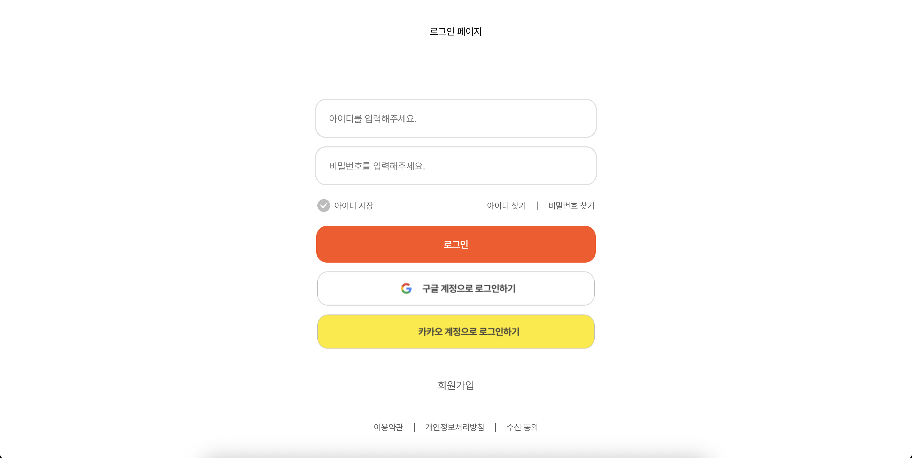

#### 3. 회원가입

- 다양한 인증 절차를 통해 하나의 이메일 당 하나의 계정을 만들 수 있도록 합니다.
  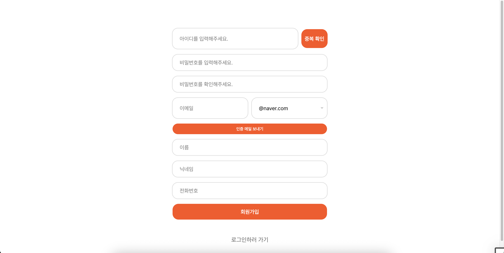

### [메인화면]

#### 1. 이주의 인기도서

- 일주일마다 이용자들의 찜 개수를 반영하여 상위 5개의 인기 도서를 보여줍니다.
- 자세히 보기 클릭시 도서 상세페이지로 이동합니다.
  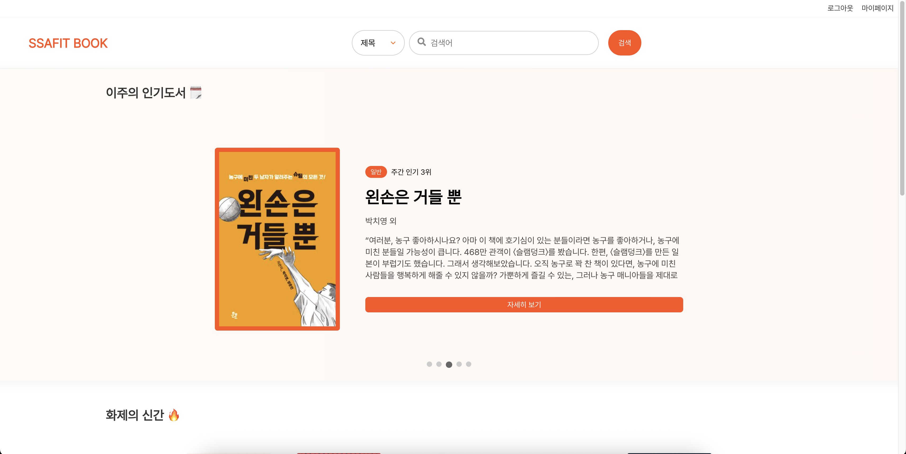

#### 2. 화제의 신간

- SSAFIT BOOK의 도서 중 가장 최근에 발매된 도서 5개를 보여줍니다.
- 책 커버 클릭시 도서 상세페이지로 이동합니다.

#### 3. 취향이 비슷한 유저

- 내가 찜했던 도서 목록을 기반으로 비슷한 책을 많이 찜한 유저 3명과 유저당 3권의 책을 보여주도록 합니다.
- 책 커버 클릭시 도서 상세페이지로 이동합니다.
  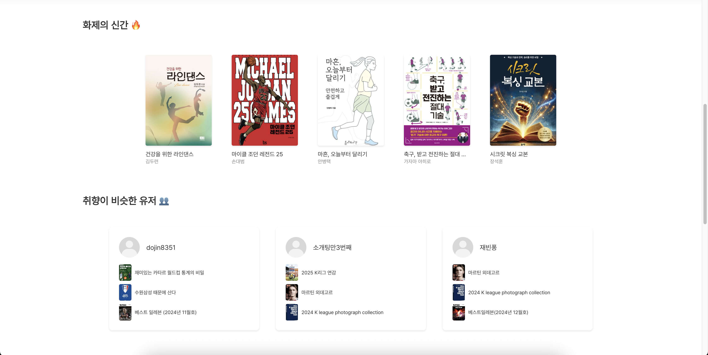

#### 4. 이달의 대출왕

- 한달동안 가장 대출을 많이 한 3명의 유저를 보여줍니다.
- 유저 프로필 클릭시 유저페이지로 이동합니다.

#### 5. 맞춤 도서 추천

- 내가 찜한 도서 목록을 기반으로 맞춤 도서를 추천해줍니다.
- 책 커버 클릭시 도서 상세페이지로 이동합니다.
  

### [검색]

#### 1. 검섹

- 기본으로 검색 버튼을 클릭시 모든 도서를 한 페이지당 20권씩 보여줍니다.
- 책 커버 클릭시 도서 상세페이지로 이동합니다.
  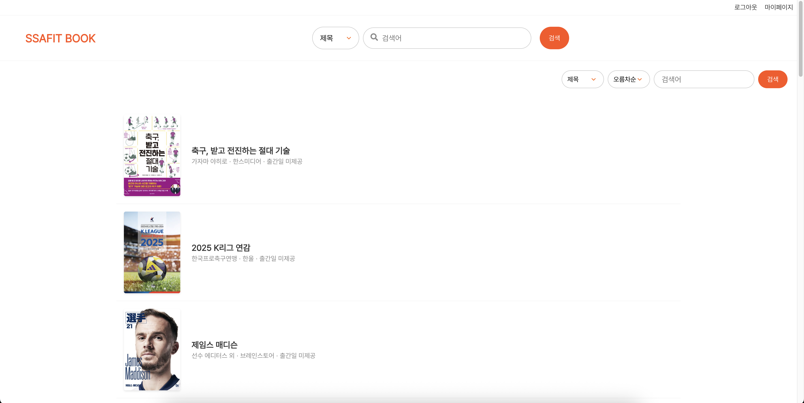

#### 2. 상세 검색

- 제목, 저자, 춢판사 / 오름차순, 내림차순으로 유저가 상세하게 도서를 검색할 수 있도록 합니다.
- 책 커버 클릭시 도서 상세페이지로 이동합니다.
  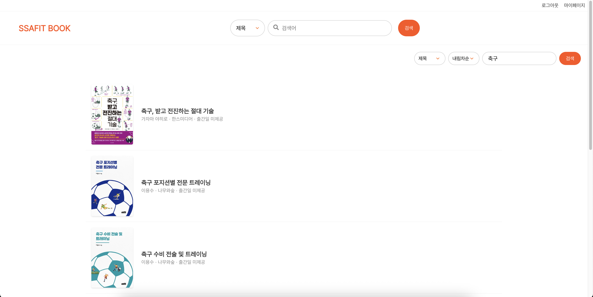

### [도서 상세]

#### 1. 도서 상세

- 표지, 제목, 저자, ISBN, 등록일자, 출판사, 소개와 대출 가능한지 여부를 알 수 있도록 합니다.
  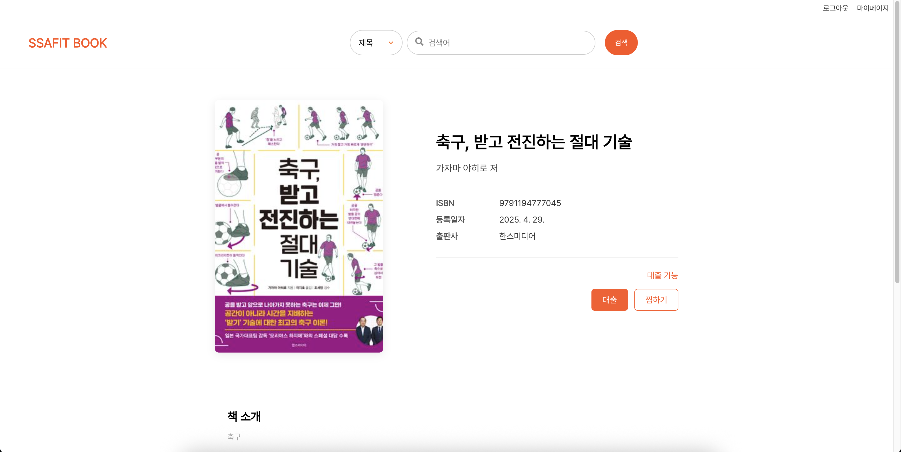
  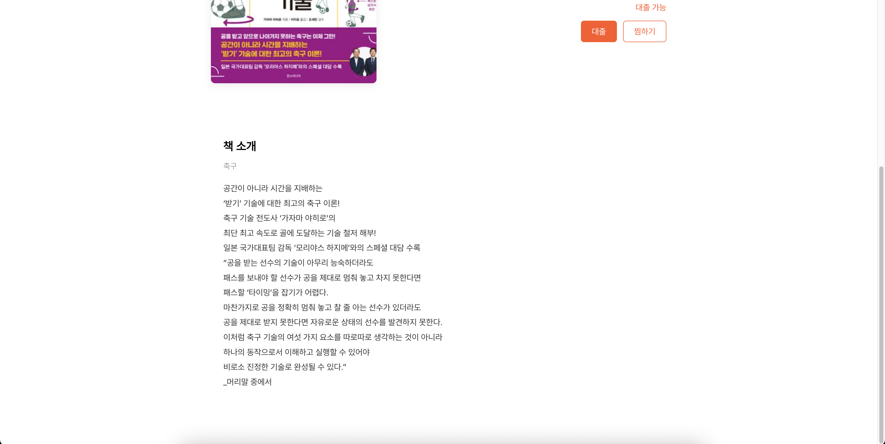

#### 2. 대출

- 유저가 대출하지 않고 현재 대출이 가능하다면 클릭시 '대출이 완료되었습니다'라는 알림이 뜨도록 합니다.
- 이미 다른 유저들이 대출했다면 대출 불가능이라고 뜨도록 합니다.
  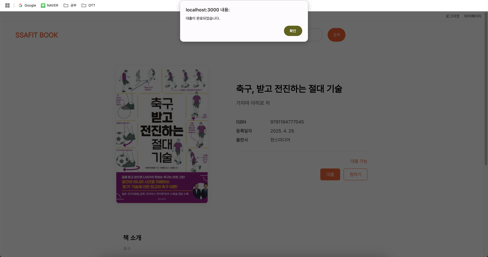

#### 3. 찜

- 찜 버튼을 클릭시 '즐겨찾기 추가가 완료되었습니다'라는 알림이 뜨도록 합니다.
- 이미 찜한 도서라면 클릭시 '즐겨찾기가 해재되었습니다'라는 알림이 뜨도록 합니다.
  

### [마이페이지]

#### 1. 유저 정보

- 정보 수정 클릭시 비밀번호를 입력하면 개인정보를 바꿀 수 있도록 합니다.
  

#### 2. 팔로우 팔로워

- 팔로우, 팔로워 목록을 볼 수 있도록 합니다.
- 팔로우 취소 클릭시 목록에서 사라집니다.
- 목록의 유저 클릭시 해당 유저의 페이지로 이동하고 해당 페이지에서 유저를 팔로우할 수 있도록 합니다.
  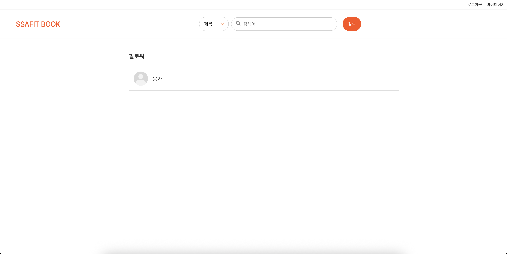
  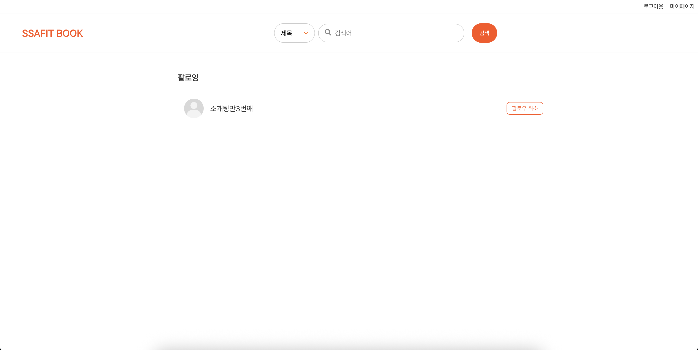

#### 3. 대출, 찜 목록

- 유저가 대출, 찜한 도서의 목록을 5개씩 보여줍니다.
- 책 커버 클릭시 도서 상세페이지로 이동합니다.
- 더보기 클릭시 유저가 대출, 찜한 모든 도서를 볼 수 있도록 합니다.
  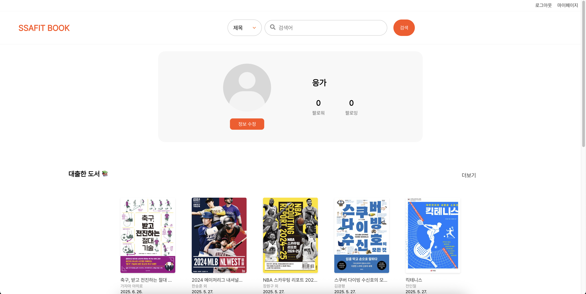

#### 4. 방명록

- 모든 유저가 방명록을 작성하고 확인할 수 있도록 합니다.
  
